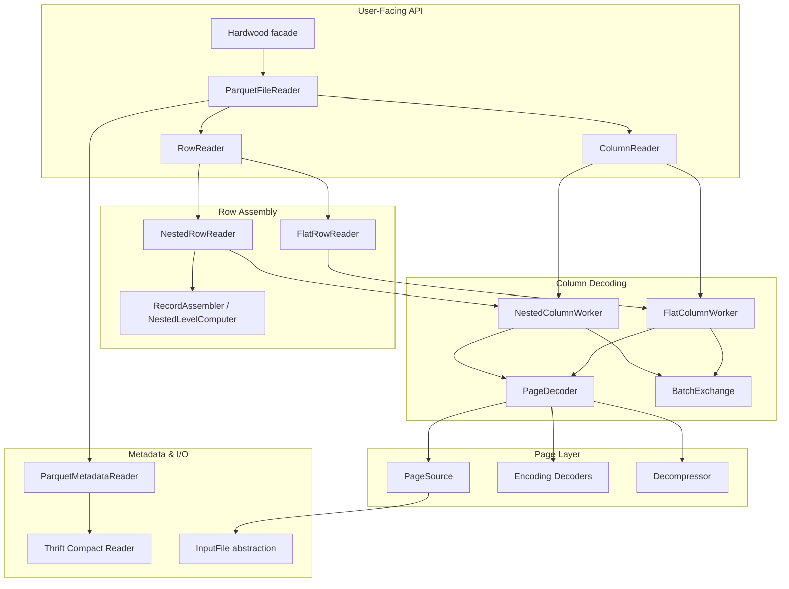
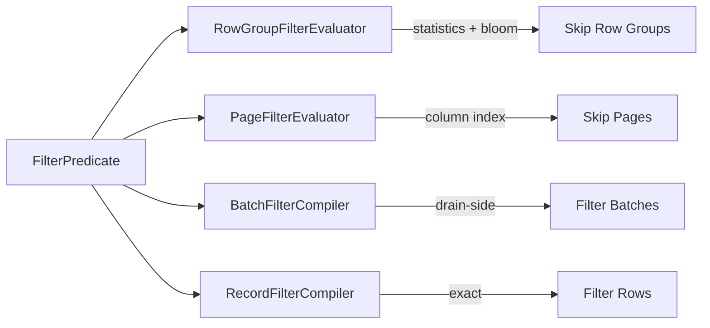

# Architecture

## System Overview

Hardwood is a from-scratch Apache Parquet reader (writer in progress) that avoids the Hadoop ecosystem entirely. The architecture is layered from raw bytes up to typed row values.

## Data Flow

1. **File Open** — `ParquetFileReader.open()` validates magic bytes, reads the Thrift-encoded footer, and constructs a `FileSchema`.
2. **Row Group Iteration** — `RowGroupIterator` walks row groups, applying predicate pushdown (statistics, bloom filters, column index) to skip non-matching groups and pages.
3. **Page Decoding** — `PageDecoder` decompresses pages, decodes definition/repetition levels, and feeds values through the appropriate encoding decoder.
4. **Batch Exchange** — Decoded values flow through `BatchExchange` from producer (column worker virtual thread) to consumer (row reader thread) in fixed-size batches.
5. **Record Assembly** — `FlatRowReader` (no nesting) or `NestedRowReader` (Dremel algorithm via `NestedLevelComputer`) assembles typed row values.

## Key Design Decisions

### Custom Thrift Parser
A full Thrift Compact Protocol implementation (`internal/thrift/`) replaces the heavyweight Apache Thrift library. Each metadata struct has dedicated reader/writer classes for explicit control over allocation.

### Flat vs Nested Split
Schemas without nesting take a fast path (`FlatRowReader` + `FlatColumnWorker`) that skips repetition/definition level tracking. This gives significant performance gains on flat data.

### Primitive-First, Zero-Boxing API
The public API (`PqIntList`, `PqLongList`, `getLong()`, `getInt()`) avoids boxing. Internal code uses primitive arrays (`int[]`, `long[]`, `double[]`).

### Virtual Threads for Parallelism
Column batch fetching uses virtual threads (`Executors.newVirtualThreadPerTaskExecutor()`) for parallel I/O and decoding, avoiding fixed thread pool sizing.

### Minimal Dependencies
Only compression libraries are external. Everything else (Thrift parsing, all encodings, Dremel assembly, S3 HTTP client, AWS SigV4 signing) is implemented from scratch.

### Multi-Release JAR
The core JAR is multi-release: Java 21 baseline, Java 22+ path for FFM-based libdeflate GZIP acceleration and SIMD Vector API operations.

### InputFile Abstraction
A single `InputFile` interface decouples reading logic from storage: `MappedInputFile` (local mmap), `ByteBufferInputFile` (in-memory), `RangeBackedInputFile` (remote/S3 with coalesced range reads).

## Predicate Pushdown Architecture

Four filter layers, evaluated from coarsest to finest:
1. **Row group** — statistics + bloom filter eliminate entire row groups
2. **Page** — column index min/max skip individual pages
3. **Batch (drain-side)** — per-batch column matcher after decoding
4. **Exact (SelectionEngine)** — precise row-level selection across columns
