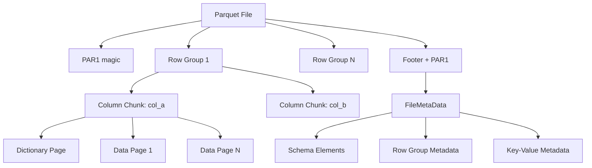

# Data Models

## Parquet Format Concepts

## Metadata Records

All metadata types are Java records in `dev.hardwood.metadata`:

### FileMetaData
- `version` (int) — Parquet format version
- `schema` (List<SchemaElement>) — Flat schema element list
- `numRows` (long)
- `rowGroups` (List<RowGroup>)
- `keyValueMetadata` (Map<String, String>)
- `createdBy` (String)
- `columnOrders` (List<ColumnOrder>)

### RowGroup
- `columns` (List<ColumnChunk>)
- `totalByteSize` (long)
- `numRows` (long)

### ColumnChunk
- `filePath` (String)
- `columnMetaData` (ColumnMetaData)

### ColumnMetaData
- `type` (PhysicalType)
- `encodings` (List<Encoding>)
- `pathInSchema` (List<String>)
- `codec` (CompressionCodec)
- `numValues` (long)
- `totalUncompressedSize` / `totalCompressedSize` (long)
- `dataPageOffset` / `indexPageOffset` / `dictionaryPageOffset` (long)
- `statistics` (Statistics)

### Statistics
- `minValue` / `maxValue` (byte[])
- `nullCount` (long)
- `distinctCount` (long)

### ColumnIndex
- `nullPages` (boolean[])
- `minValues` / `maxValues` (List<byte[]>)
- `boundaryOrder` (BoundaryOrder)
- `nullCounts` (long[])

### OffsetIndex
- `pageLocations` (List<PageLocation>)
  - Each: `offset` (long), `compressedPageSize` (int), `firstRowIndex` (long)

## Schema Types

### FileSchema
The root schema container. Provides:
- `columns()` — List of leaf `ColumnSchema` nodes
- `column(name)` — Lookup by simple or dot-notated name
- `rootNode()` — Tree access to `SchemaNode` hierarchy

### SchemaNode
Tree node representing a schema element:
- `name`, `repetitionType`, `physicalType`, `logicalType`
- `children` (for group nodes)
- `maxDefinitionLevel`, `maxRepetitionLevel` (for leaf nodes)

### ColumnSchema
Leaf-level column descriptor:
- `name`, `fieldPath` (FieldPath)
- `physicalType`, `logicalType`
- `maxDefinitionLevel`, `maxRepetitionLevel`
- `typeLength` (for FIXED_LEN_BYTE_ARRAY)

### FieldPath
Dot-separated path to a leaf column (e.g., `address.city.zipcode`).

## Physical Types (Enum)

`BOOLEAN`, `INT32`, `INT64`, `INT96`, `FLOAT`, `DOUBLE`, `BYTE_ARRAY`, `FIXED_LEN_BYTE_ARRAY`

## Logical Types (Sealed Interface)

- String types: `STRING`, `ENUM`, `UUID`, `JSON`, `BSON`
- Numeric: `INT(bitWidth, signed)`, `DECIMAL(scale, precision)`
- Temporal: `DATE`, `TIME(unit, utcAdjusted)`, `TIMESTAMP(unit, utcAdjusted)`
- Complex: `LIST`, `MAP`, `VARIANT`
- Other: `INTERVAL`

## Compression Codecs (Enum)

`UNCOMPRESSED`, `GZIP`, `SNAPPY`, `LZ4`, `LZ4_RAW`, `ZSTD`, `BROTLI`

## Encodings (Enum)

`PLAIN`, `RLE_DICTIONARY`, `PLAIN_DICTIONARY`, `RLE`, `BIT_PACKED`, `DELTA_BINARY_PACKED`, `DELTA_LENGTH_BYTE_ARRAY`, `DELTA_BYTE_ARRAY`, `BYTE_STREAM_SPLIT`

## Writer Data Model

### ColumnBatch
Represents a batch of column values to write:
- Typed value arrays (int[], long[], double[], byte[][])
- Definition and repetition levels
- Null tracking via validity bitmaps

### WriterConfig
- `rowGroupSize` (bytes) — Threshold for flushing a row group
- `pageSize` (bytes) — Target data page size
- `dictionaryPageSize` (bytes) — Max dictionary page size before fallback
- `compressionCodec` — Codec to use for all columns
- `writerVersion` — Parquet format version (V1 or V2 data pages)
