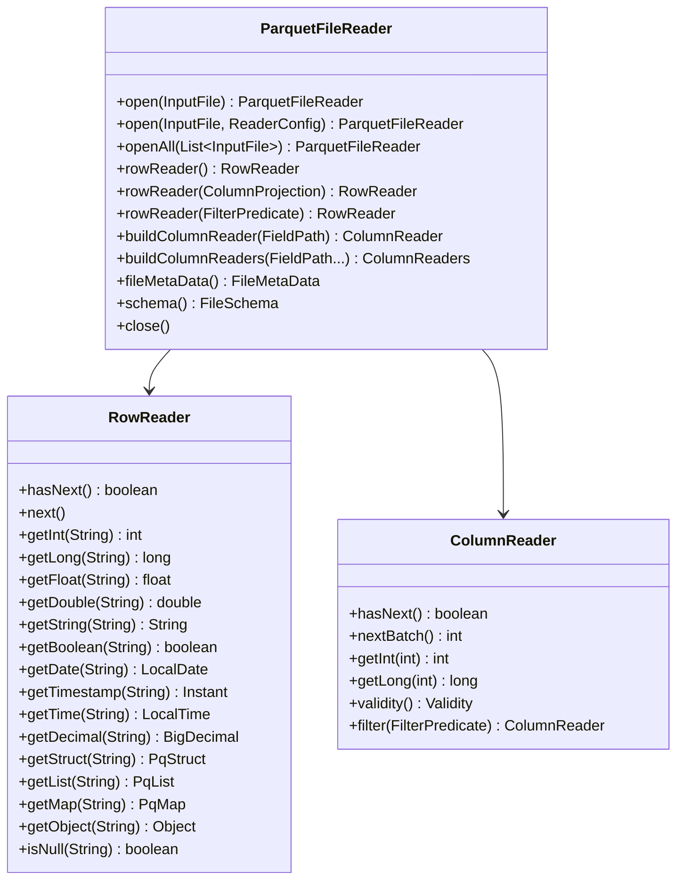

# Interfaces & APIs

## Public Reader API

### ParquetFileReader

Primary entry point for reading Parquet files.



### InputFile

Storage abstraction interface.

| Factory Method | Backend |
|----------------|---------|
| `InputFile.of(Path)` | Memory-mapped local file (arbitrary size) |
| `InputFile.of(ByteBuffer)` | In-memory buffer (≤ 2 GB) |
| `S3InputFile.builder()` | S3 object store |

### FilterPredicate

Sealed interface hierarchy for predicate pushdown.

| Predicate | Description |
|-----------|-------------|
| `FilterPredicate.eq(field, value)` | Equality |
| `FilterPredicate.notEq(field, value)` | Inequality |
| `FilterPredicate.lt/ltEq/gt/gtEq(field, value)` | Comparisons |
| `FilterPredicate.in(field, values...)` | Set membership |
| `FilterPredicate.and(left, right)` | Conjunction |
| `FilterPredicate.or(left, right)` | Disjunction |
| `FilterPredicate.not(predicate)` | Negation |

Supported value types: `int`, `long`, `float`, `double`, `boolean`, `String`, `byte[]`.

### ColumnProjection

Column selection for reading a subset of columns.

```java
ColumnProjection.of("id", "name", "address.city")  // flat + dot-notation for nested
```

### ReaderConfig

Immutable per-read configuration:
- Fixed-size list fast-path toggle
- Future: batch sizing, parallelism hints

## Public Writer API (Early Stage)

### ParquetFileWriter

```java
ParquetFileWriter.open(OutputFile, FileSchema, WriterConfig)
    .writeColumnBatch(ColumnBatch)
    .close();
```

### WriterConfig

Configuration: row group size threshold, page size, dictionary page size, compression codec, Parquet version.

### FileSchema.Builder

Fluent schema construction:
```java
FileSchema.builder("message")
    .addInt32("id", RepetitionType.REQUIRED)
    .addBinary("name", RepetitionType.OPTIONAL, LogicalType.STRING)
    .build();
```

## Row Value Types

| Type | Access Pattern |
|------|---------------|
| `PqStruct` | `getInt("field")`, `getString("field")`, `getStruct("nested")` |
| `PqList` | `strings()`, `ints()`, `structs()`, `size()` |
| `PqIntList` / `PqLongList` / `PqDoubleList` | `get(index)`, `size()` — unboxed primitives |
| `PqMap` | `keys()`, `get(key)`, `getStruct(key)`, `size()` |
| `PqVariant` | `type()`, `asInt()`, `asString()`, `asObject()`, `asArray()` |
| `PqInterval` | `months()`, `days()`, `millis()` |

## S3 API

```java
S3InputFile.builder()
    .bucket("my-bucket")
    .key("data/file.parquet")
    .region("us-east-1")
    .credentials(S3Credentials.of(accessKey, secretKey))
    // or .credentialsProvider(provider)
    .build();
```

## Avro API

```java
try (AvroRowReader reader = AvroReaders.open(inputFile)) {
    for (GenericRecord record : reader) {
        // Avro GenericRecord access
    }
}
```

## CLI Interface

```
hardwood [command] [options] <file>

Commands:
  info        File overview
  schema      Display schema
  print       Print rows
  convert     Format conversion
  inspect     Detailed metadata inspection
  footer      Raw footer
  dive        Interactive TUI
```
