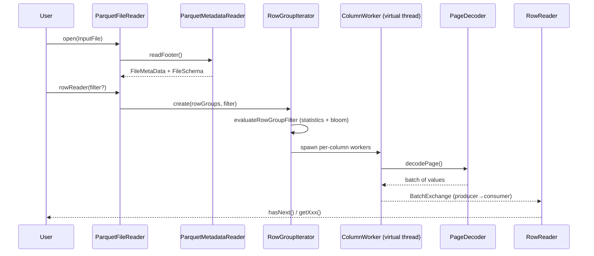
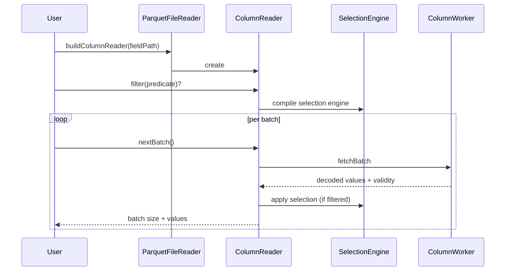
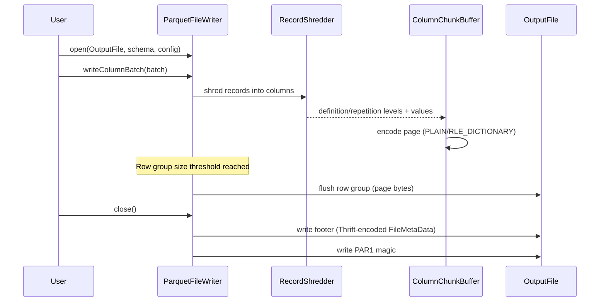
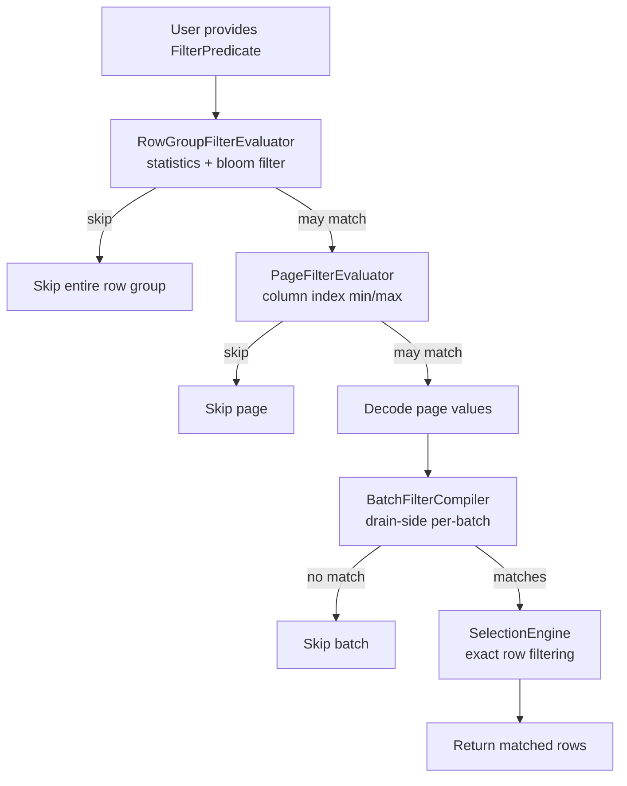
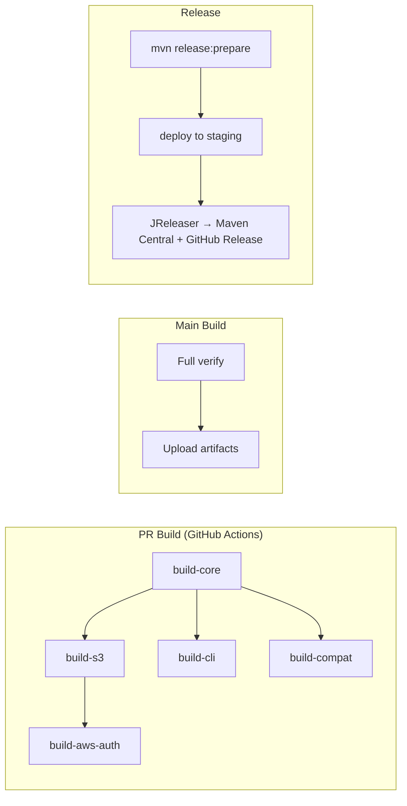
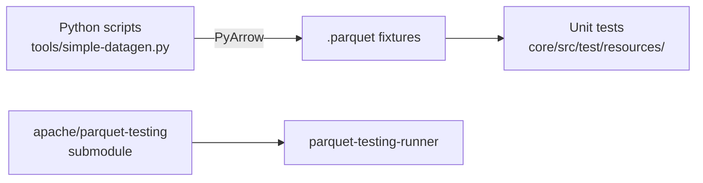
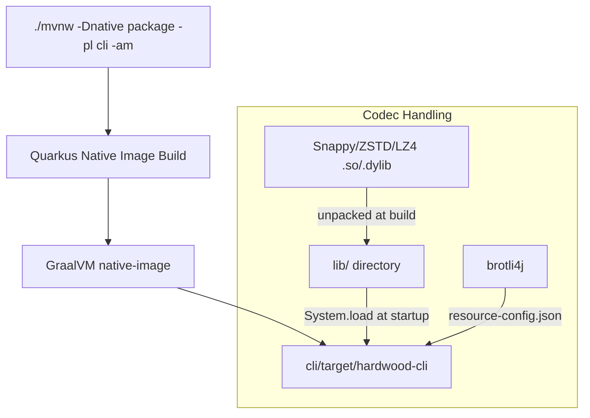

# Workflows

## Read Path (Row-Oriented)

## Read Path (Column-Oriented)

## Write Path

## Predicate Pushdown Flow

## Build & CI Workflow

## Test Data Generation

## Native CLI Build

## Documentation Site

Built with MkDocs (Python), Dockerized:
1. `docker build -t hardwood-docs docs/` — Build image
2. `docker run --rm -p 8000:8000 -v "$(pwd):/repo" hardwood-docs` — Live preview at localhost:8000
3. GitHub Actions publishes to hardwood.dev on merge to main

Content follows the Diátaxis model: `tutorial/`, `how-to/`, `reference/`, `concepts/`.
