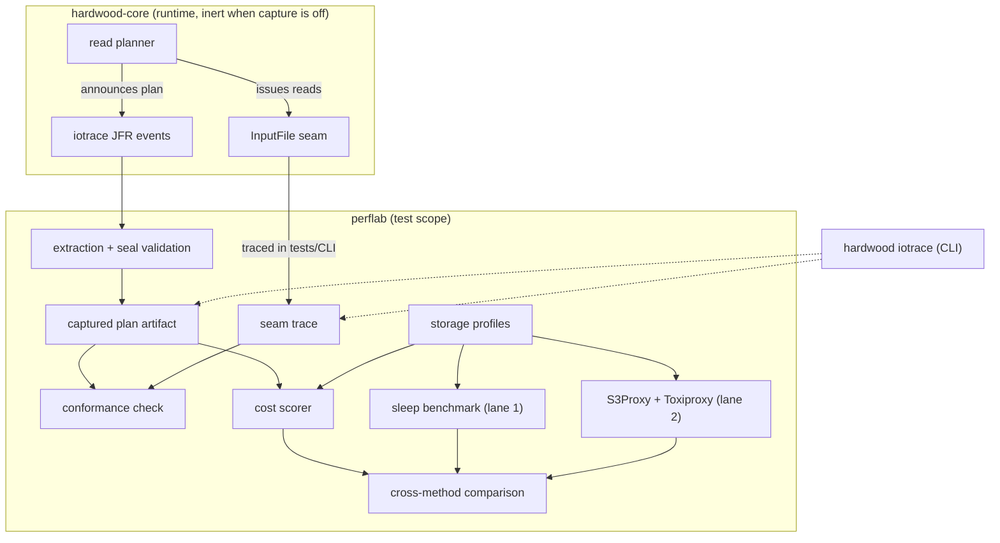

# Perflab: evidence for I/O planning decisions (#827)

- **Status:** draft, seeking early feedback on the idea and its scope
- **Proof of concept:** [`artemkach/hardwood`, branch `capture`](https://github.com/artemkach/hardwood/tree/capture) — nothing merged or final

---

## 1. Executive summary

Hardwood's decode performance is well measured. Its I/O planning is not:
the constants that decide how reads are grouped and issued were chosen by
intuition, and issue #763 says so in as many words. Whether those choices
are good depends on where the data lives — a plan that is optimal against
local disk can be the wrong plan against S3 — and today we have no way to
find out short of guessing.

**Perflab** is a set of instruments for answering such questions with
measurements: capture what the read planner decided, compute what those
decisions should cost under stated storage assumptions, and check the
predictions against controlled execution. No single method settles a
question — a cost model omits real mechanisms, a real run can't be swept
across conditions — so the instruments are built to cross-check one
another. Agreement builds confidence; disagreement points at a specific
missing assumption and becomes the next experiment.

A proof of concept already exists: a JFR-based capture instrument with a
CLI command (`hardwood iotrace`) that shows the planner's fetch plan and
the actual reads for any file, a small cost model that prices captured
plans, and groundwork for a controlled-transport test bed. An afternoon of playing
with the CLI produced a result worth the whole exercise (§6): the same
file, read with two different planning strategies, gave *opposite* verdicts
in different environments. No single constant can be right everywhere —
and mapping the conditions is exactly what a lab is for.

Perflab is deliberately loosely coupled: the instrumentation costs nothing
when disabled, adds no public API, and the planner does not depend on any
of it. Hardwood works exactly the same whether the lab exists or not.

This document asks for agreement on the direction and the first increment's
scope — not approval of the proof of concept as-is.

---

## 2. Contents

- [3. Motivation](#3-motivation)
- [4. Scope](#4-scope)
- [5. Background](#5-background)
- [6. Intuitions](#6-intuitions)
- [7. Proof of concept](#7-proof-of-concept)
- [8. Design](#8-design)
- [9. Open questions](#9-open-questions)
- [10. FAQ](#10-faq)
- [Appendix A: the capture protocol, in detail](#appendix-a-the-capture-protocol-in-detail)
- [Appendix B: the break-even arithmetic](#appendix-b-the-break-even-arithmetic)
- [Appendix C: transport calibration protocol](#appendix-c-transport-calibration-protocol-lane-2)
- [Appendix D: the pilot experiment](#appendix-d-the-pilot-experiment)
- [Appendix E: demo runs — outputs and findings](#appendix-e-demo-runs--outputs-and-findings)
- [Appendix F: the row-group-count experiment](#appendix-f-the-row-group-count-experiment)
- [Sources](#sources)

---

## 3. Motivation

[Issue #763](https://github.com/hardwood-hq/hardwood/issues/763)
("Adaptive, latency-aware I/O coalescing for remote backends") identifies
the problem precisely:

> There is no S3 read benchmark, so every constant above is tuned against
> intuition. Before changing any I/O planning code we need a deterministic,
> CI-friendly way to measure read wall-clock under controlled storage
> latency — real S3 is flaky and non-reproducible.

Its step 1 is a latency-injecting `InputFile` decorator and a JMH benchmark.
Steps 2–4 build toward a storage profile on `InputFile` and online
refinement of latency/bandwidth estimates. Perflab embraces that plan —
the sleep benchmark *is* one of the lab's instruments — and asks a broader
question around it: once we can measure, what do we measure, how do we
know the measurements mean what we think, and how does evidence eventually
become a production default?

Ordinary profiling cannot answer these questions, because they are
invisible on a developer laptop. Reading a local file through mmap, a
fetch costs under a microsecond — the cost of a bad plan is approximately
zero, so there is nothing for a profiler to see. You cannot profile a wait
that never happens. The waits only exist when storage has a price, which
means either injecting a modeled price (fast and reproducible, but only as
good as the model) or paying a real one (faithful, but slow and noisy).
The lab uses both and checks them against each other.

The eventual payoff goes beyond test tooling: a pipeline where offline
evidence graduates into small, clamped, defensible production policies.
#763's own steps 3–4 (a `StorageProfile` prior, online refinement) are the
first two graduations. The lab is the place where a candidate policy is
priced, stress-tested, and either promoted with evidence attached or
rejected cheaply. And when the evidence eventually supports #763's
adaptive end state, the lab's fixtures and captured plans become that
policy's regression corpus — the instruments outlive the decisions they
inform.

---

## 4. Scope

Perflab starts with read-path I/O decisions above `InputFile.readRange`,
using real Parquet fixtures and the real planner throughout. Deferred items
are named so their absence reads as a known limitation, not an oversight:

| In the first increment | Deferred |
|---|---|
| **iotrace** capture: fetch plans, executed reads, completeness checks (prototyped) | Reads discovered during decode (lazy sequential chunks) — recorded as `INCOMPLETE`, not modeled |
| **Analytic scorer** over captured plans (prototyped) | Aggregate-bandwidth modeling — the first model prices per-connection bandwidth only, and every result says so (§7 shows this term biting) |
| **Sleep-mode benchmark** — #763 step 1 as specified | Retries, hedging, cancellation, TLS/ALPN, HTTP-version experiments (need a real endpoint) |
| **Small transport lane**: existing S3Proxy + narrowly scoped Toxiproxy (feasibility verified) | The write path (multipart uploads have their own economics; writer increment 19 is the natural later consumer) |
| First **cross-method comparison**: do the methods agree on which of two plans is faster? | Any production behavior change (current planner defaults stay), any new supported public API |

---

## 5. Background

### 5.1 How the read planner works today

Hardwood's reader is a pipeline: a set of column workers, each on its own
virtual thread, pulls pages for its column, decodes them, and hands
batches to the row assembler. Fetch plans are built lazily, one row group
at a time as the workers reach it, and some reads are only discovered
mid-decode — there is no complete file plan at open time. That fact shapes
the capture design in §8.4: the lab cannot ask for "the plan" up front,
and it must not invent a second planner from footer metadata; the real
planner has to publish the decisions it actually made, as it makes them.

The planning decisions in question are the coalescing thresholds — which
nearby reads to merge into one request, the cross-column gap (64 KiB)
being #763's headline example. Fusing saves round-trips but transfers dead
bytes; splitting avoids the dead bytes but pays more round-trips, unless
the requests truly run in parallel, in which case the arithmetic changes
again (Appendix B works it through). One distinction worth keeping in mind
throughout: today these thresholds are **fixed configuration** — identical
for every file and backend. #763's end state makes some of them **runtime
decisions**, informed by what the storage actually costs, possibly refined
from live measurements the way DuckDB now does in shipped code (§5.3). The
lab's job is to supply the evidence for that transition; it does not itself
change any production behavior.

### 5.2 The questions

From #763 and from studying the planner, the questions the lab should be
able to answer:

1. Is the current cross-column gap right for S3? For local disk? Is any
   single constant right for both?
2. When does splitting a fused read into parallel requests actually help,
   and when does it hurt?
3. What are realistic latency and bandwidth numbers for the storage
   backends users actually run against, and how much do the answers to
   questions 1–2 change across them?
4. When our model of storage cost disagrees with a real transport, which
   term is missing?
5. Can a candidate planner change be screened cheaply — in microseconds of
   arithmetic — before anyone spends a day benchmarking it?
6. How much of the answer is about gap tuning at all? Hardwood plans one row
   group at a time (§5.1) and prefetches strictly one-ahead, so the number of
   requests it can have in flight is bounded by the projected column count of
   the current row group. DuckDB's published row-group-size sweep (§5.3
   sources) shows that same bound costing up to 12x on identical data once row
   groups grow large enough that too few requests exist to fill the link.
   Read-ahead *depth* may dominate the threshold question the lab was built to
   answer; Appendix F is the experiment that would tell us.

### 5.3 Prior art

Other Parquet readers face the same coalescing question, and it is
instructive how differently they answer it. Most picked a constant and
moved on; the constants disagree with each other by factors of a thousand,
and few come with any recorded reasoning:

| Project | Cross-read merge gap | How chosen |
|---|---|---|
| Hadoop S3A (vectored IO) | 4 KiB | no derivation found |
| Arrow C++ | 8 KiB default; optional `latency × bandwidth` helper | helper exposed, no reader calls it automatically |
| DuckDB (`v2.0.0-dev`) | 16 KiB static until the first measurement, then **`latency × bandwidth`** clamped to `[4 KiB, 32 MiB]`, EWMA-smoothed | in-reader cost model fed by an online estimator; also pinnable as a user setting |
| Velox | 512 KiB | constant in config |
| arrow-rs | 1 MiB | constant, no derivation |
| ClickHouse | 4 MiB (inverted: min bytes worth a seek) | constant |
| **Hardwood** | **64 KiB** | tuned against local intuition (#763's words) |

The interesting entries are the two that *derived* their number. Arrow C++
and DuckDB both use the **bandwidth-delay product**: fuse two reads when
transferring the dead bytes between them costs less than paying another
request's startup latency. DuckDB goes further and refines the estimate at
runtime from measured throughput — the fixed-configuration versus
runtime-decision distinction from §5.1, with DuckDB the only surveyed
reader on the runtime side.

DuckDB's version is worth reading closely, because it is the closest thing
to #763's end state that exists in shipped code, and it is specific where
this design is still deciding. The model is `gap = L × B`, clamped to
`[GAP_MIN = 4 KiB, GAP_MAX = 32 MiB]`, with non-positive and NaN results
falling to the floor. `(L, B)` are smoothed with an exponentially weighted
moving average (α = 0.5) and are seeded empty, so the first row group of any
scan uses the 16 KiB static default and only later row groups see a measured
gap. The threshold is also exposed as an ordinary user setting
(`parquet_prefetch_column_gap`), clamped by `GAP_MAX`, where `0` means never
merge — relevant to this design's own override question (§9, question 3).

**Where the two numbers come from is the more transferable part, and DuckDB
uses two different estimators depending on what the transport can report.**
On the remote path, each completed range request contributes a sample of
`(total_seconds, bytes, ttfb_seconds)`: latency is smoothed straight from
measured time-to-first-byte, and bandwidth is `bytes / (total − ttfb)`,
updated only for samples of at least 64 KiB so small reads cannot corrupt
the rate term. On the local path there is no time-to-first-byte to observe,
so the estimator instead **fits a line by least squares** over the handle's
own reads — `total_time = intercept + slope × bytes`, taking `L = intercept`
and `B = 1 / slope`. That fit refuses to produce an estimate until it has
seen at least two reads *of different sizes*, for the reason its own comment
gives: with one size, the fixed and per-byte costs are not separately
identifiable. Both estimators are per-file-handle and reject degenerate fits
(non-positive latency, bandwidth, or slope) rather than reporting a number
they cannot justify.

Three things follow for Hardwood. First, `L + bytes/B` is not just this
lab's modeling convention — it is the functional form a production reader
found sufficient to act on, which is mild evidence that the first cost model
(§8.5) is shaped correctly even though it is deliberately thin. Second, the
TTFB split is available to Hardwood essentially for free: `S3InputFile`
already receives an `HttpResponse<InputStream>`, so `send()` returns when
headers arrive and the body is drained afterwards in a read loop — two
timestamps at that existing seam separate `L` from `B` with no extra request
and no regression fit. That is a concrete note for #763 step 4, not
something this lab needs. Third, the identifiability constraint is a real
limit on any online refinement, not a detail: a fetch plan that only ever
issues one read size cannot calibrate itself, which is why the transport
lane's calibration sweeps several sizes (Appendix C) rather than measuring
one.

**A caution about scope that the same code delivers:** in DuckDB the gap is
no longer the only planning decision, and arguably no longer the interesting
one. Per row group it also chooses a *strategy* — fetch the whole row group's
span as one request with merging disabled; fetch filter columns first and the
payload only for row groups that survive; or register each column separately
with merging enabled — gated on how much of the span is actually being
scanned (a 95% threshold) and on how selective filters have proven to be so
far in this scan (a 90% match-ratio threshold, accumulated across row
groups). The selection is stateful and carries across recycled scan states,
so early row groups run "unlearned" and later ones do not. This design keeps
its scope at thresholds deliberately (§4), and that stays right for a first
increment — but it means the captured plan artifact should record *which
policy produced it*, not only the byte ranges that resulted, or a future
comparison between two policies will be indistinguishable from a comparison
between two threshold values. §8.9's experiment record already has a
"contender: planner configuration and effective settings" row; this is the
argument for keeping it and populating it honestly from the start.

The formula comes with a catch, though, worked through in Appendix B: it
describes the *serial* case. When split requests genuinely run in
parallel, splitting wins at any gap — until something (a connection limit,
a shared network path, a dependency) reintroduces serial structure. So the
useful question is never "what is the right gap" but "under which
conditions does each choice win," and that is a question for a lab with
explicit cost models, answered cell by tested cell.

For grounding those models there is good published data: the AnyBlob paper
(VLDB 2023) measured S3 from EC2 and fitted a simple
`latency + size / bandwidth` relationship with concrete medians — citable
defaults for a same-region profile, though not universal constants.

Finally, a search across the usual suspects (Iceberg, Trino, Velox,
parquet-java, arrow-rs, Arrow C++, DuckDB, DataFusion, and others) found
latency-injection test utilities, in-reader cost models, and — in DuckDB's
case — a shipped plan-capture surface. What it did not find is a harness
that captures a reader's fetch plans and then **prices them offline under
declared cost models**, or one that treats capture completeness as something
to be proven rather than assumed. Those two pieces appear to be new, stated
carefully: new among the projects searched.

The DuckDB precedent is worth stating explicitly rather than buried, because
it validates half of this design's instinct. DuckDB emits one structured
record per row group under a named log channel (`ParquetPrefetch`), queryable
as an ordinary table, carrying the file, row group, chosen strategy, the
accepted gap in bytes, the physical column-name batches actually issued in
order, and which filters ran. Columns that ride along inside a fetched range
without having been requested are marked in that output — independently
arriving at this design's over-fetch accounting (§7.2). The fields are
populated only when the channel is enabled, which is the same
inert-when-disabled discipline as §8.1. So "publish the planner's decisions
as structured, machine-readable records" is not an exotic idea; it is what
the one surveyed reader with an adaptive policy also concluded it needed, and
it is a point in favour of shipping `hardwood iotrace` rather than keeping it
a private tool (§9, question 2).

What DuckDB's capture does not have is any notion of completeness: no seals,
no manifest, no independent trace to conform against, and therefore no way
to distinguish a decision that was never made from a record that was never
written. Its tests assert on the log directly and accept that (§10 borrows
the assertion pattern, which is good). Nothing prices a captured plan under
a stated `(L, B, concurrency)` triple, and nothing sweeps conditions — the
model is consulted online and its output is observed, never replayed. Those
are the parts this design adds.

### 5.4 The simulation–emulation continuum

The lab's methods sit at different points on a spectrum between pure
arithmetic and the real thing, and each point has a characteristic strength
and blind spot:

| Method | Examples | Strength | Blind spot |
|---|---|---|---|
| Fixed policy, no measurement | most surveyed readers | cheap, predictable | assumptions stay implicit |
| Cost model | Arrow C++, DuckDB, the lab's scorer | fast sweeps, deterministic | omits every mechanism outside the model |
| Controlled delay | DuckDB `debug_fs`, arrow-rs `ThrottledStore`, #763's benchmark | runs the real planner and reader | replaces the transport with a formula |
| Emulated transport | Arrow's MinIO benchmark, S3Proxy + impairment | exercises the client, sockets, pools | not a real cloud service |
| Real service | AnyBlob, manual S3 runs | the full path | slow, noisy, hard to command |

Each step down gains realism and loses control. The lab's central
discipline is to use the fast end for exploration and the slow end for
confirmation — and to treat disagreements between adjacent methods as
findings about what the faster method's model is missing.

DuckDB's `debug_fs` is the most developed instance of the controlled-delay
row and is worth measuring this design against, in both directions. It is a
pass-through filesystem decorator that delays open, read, and write — never
metadata operations — by a sample drawn from a **lognormal distribution
moment-matched to a requested mean and standard deviation**, with the random
seed pinnable and logged so a run can be reproduced exactly. A zero mean is a
fast-path no-op. That is two things #763's sketch and §8.7 do not have: a
latency *distribution* rather than a constant (Appendix B currently lists
tails as an unmodeled omission), and a way to keep a stochastic injector
deterministic. §8.7 adopts both.

In the other direction, `debug_fs` injects latency only — there is no
`bytes/B` term, so it cannot express a bandwidth-bound regime at all — and
its throughput-estimate hook simply delegates to the underlying filesystem.
Injected latency therefore never reaches DuckDB's own cost model, which means
DuckDB cannot test "the policy responds correctly to a declared storage
profile" end to end; its cost-model tests use a real remote endpoint and
assert loose bounds instead (§10). Closing exactly that loop — a declared
profile that both the injector and the scorer consume — is what lane 1 is
for, and it is the sharpest available answer to why this lab is more than a
latency decorator.

---

## 6. Intuitions

Let's start by introducing the key concepts at an intuitive level — the
precise contracts live in the design (§8) and Appendix A.

**Plan — the shopping list.** Before touching the network, the planner
decides which byte ranges it will fetch. Captured and written down, that
decision is the *plan*: a set of **nodes** (one node = one future request),
each carrying the per-column **requirements** it serves. When two columns'
reads are fused, that is one node serving two requirements:

```text
  column a needs [0 .. 1 MiB)   ──┐
                                  ├──►  node 1: fetch [0 .. 2 MiB)   (fused)
  column b needs [1 .. 2 MiB)   ──┘
  column c needs [2.2 .. 3 MiB) ────►  node 2: fetch [2.2 .. 3 MiB)
```

**Trace — the receipt.** A plain record of every read that *actually
happened* at the `InputFile` boundary: offset, length, when it started,
how long it took. It knows nothing about intentions — a receipt line
saying "2 MiB at offset 0" can't tell whether that was two columns fused
or one big column. Correlating the trace with the plan is what
establishes **causality**: every read is matched to the planned request
it executed.

**Conformance — do they match?** Every planned node executed exactly once,
nothing missing, nothing extra. What this buys is *measurement validity*:
proof that the plan we are about to price is the plan that actually ran.
(Correct values are checked separately, by the test fold.)

**Seals — the "that's everything" stamp.** JFR may drop events under
pressure, and a lost record doesn't look broken — it looks like nothing.
So each plan and each execution ends with a *seal* carrying record counts
and a content hash; extraction recomputes both and rejects the capture on
any mismatch, rather than silently scoring an incomplete one:

```text
  records    prove  what happened
  seals      prove  the records are ALL of what happened
  manifest   proves the seals are ALL of what was supposed to happen
```

**Cost model — the price list.** Three numbers describe a pretend storage
service: a flat per-request latency `L` (the delivery fee), a
per-connection bandwidth `B` (the per-byte fee), and a concurrency limit
(how many trucks at once). One request costs `L + bytes/B`. The flat fee
is what makes planning interesting: sometimes buying dead bytes you'll
throw away (fusing) beats paying a second delivery charge. The **scorer**
walks a plan through the price list and returns a completion time —
deterministic, microseconds to compute, and always model-relative: "under
these assumptions, plan X beats plan Y."

Because scoring is nearly free, it enables **sweeps**: evaluate a whole
grid of conditions — gap sizes × latency × bandwidth × concurrency — in
seconds, and see where in that space the verdict flips. Execution methods
then check a few chosen cells of the grid rather than all of them. That
division of labor is the **evidence ladder** the lab climbs for any claim:

```text
  scorer sweep eliminates clearly-bad candidates      (cheap, model-relative)
      └─► sleep benchmark checks the interesting cells (real reader, modeled price)
              └─► emulated transport cross-checks      (real HTTP stack)
                      └─► real S3 confirms             (only for AWS-specific claims)
```

The one-line summary: **capture an iotrace, price it against a cost model,
sweep the conditions, and climb the ladder to confirm what matters.**

---

## 7. Proof of concept

A working prototype exists on branch
[`capture`](https://github.com/artemkach/hardwood/tree/capture).

### 7.1 What's built

- **Capture** publishes the planner's final post-coalescing request nodes
  through default-disabled
  [JFR events](https://github.com/artemkach/hardwood/tree/capture/core/src/main/java/dev/hardwood/jfr/iotrace).
  (The spike also built an in-memory observer as a fallback and validated
  JFR against it; JFR passed every acceptance property — exact
  reconstruction, correlation across async handoffs, loss detection, no
  disabled-path overhead — so it is the mechanism.) Node identity rides on
  the actual request objects, so every executed read is attributed to its
  planned node even across async prefetch handoffs.
- **Extraction and validation**
  ([`PlanExtractor`](https://github.com/artemkach/hardwood/blob/capture/core/src/main/java/dev/hardwood/internal/iotrace/PlanExtractor.java))
  reconstruct a canonical plan artifact from a recording and reject
  incomplete captures via the seal protocol, with a
  [loss-injection test](https://github.com/artemkach/hardwood/blob/capture/core/src/test/java/dev/hardwood/internal/iotrace/PlanExtractorLossTest.java)
  for every rejection mode.
- **The scorer**
  ([`PlanScorer`](https://github.com/artemkach/hardwood/blob/capture/core/src/test/java/dev/hardwood/scorer/PlanScorer.java))
  prices plans under `(L, B, concurrency)` with overflow-checked
  arithmetic; its
  [unit tests](https://github.com/artemkach/hardwood/blob/capture/core/src/test/java/dev/hardwood/scorer/PlanScorerTest.java)
  are hand-computed, including the boundary cases and a counterexample
  described in Appendix B.
- **`hardwood iotrace`**
  ([`IoTraceCommand`](https://github.com/artemkach/hardwood/blob/capture/cli/src/main/java/dev/hardwood/cli/command/IoTraceCommand.java))
  wires it into the CLI: run a real read, discard the values, render the
  plan (as a byte-layout map), the timed trace, and the conformance
  verdict. A `--max-gap` override makes the planner produce fused and
  split plans on identical bytes, so two contenders can be compared with
  two commands.
- **Transport groundwork**
  ([`TransportImpairmentSpikeTest`](https://github.com/artemkach/hardwood/blob/capture/s3/src/test/java/dev/hardwood/s3/TransportImpairmentSpikeTest.java)):
  verified on the pinned S3Proxy image that its latency middleware works
  and its bandwidth throttle does not (it fails outright at realistic
  rates), which is why Toxiproxy supplies the bandwidth dimension;
  Toxiproxy pinned by digest and smoke-checked.
- **Overhead**: with capture disabled — the always-case in production —
  the instrumentation adds no measurable cost
  ([`DisabledPathOverheadTest`](https://github.com/artemkach/hardwood/blob/capture/core/src/test/java/dev/hardwood/internal/iotrace/DisabledPathOverheadTest.java)).

### 7.2 What the demo showed

Here is `hardwood iotrace` reading a 7.4 MB file from S3 in another region
— the plan (one fused request covering all seven columns), the actual
reads with timings, and the match between them:

```text
$ hardwood iotrace -f s3://…-ap-southeast-2/profiling_uncompressed_dict.parquet
Plan 0
  bytes [4 .. 7811814)  (7.4 MB)
  ████████████████████████████████████████████████████████████████
  +------+-------+----------------+--------+------------------------+
  | Node | Stage | Range          | Length | Serves                 |
  +------+-------+----------------+--------+------------------------+
  |    1 |  DATA | [4 .. 7811814) | 7.4 MB | 7 requirements (fused) |
  +------+-------+----------------+--------+------------------------+

Trace (4 reads at the InputFile seam, invocation order)
  +---+-----------+----------+---------+--------+----------+
  | # | Begin     | Duration | Offset  | Length | Matched  |
  +---+-----------+----------+---------+--------+----------+
  | 1 |   t+0.0µs |  235.1ms |       0 |    4 B | metadata |
  | 2 | t+235.1ms |    2.7µs | 7813381 |    8 B | metadata |
  | 3 | t+235.1ms |    0.4µs | 7811814 | 1.5 KB | metadata |
  | 4 | t+236.3ms | 1929.0ms |       4 | 7.4 MB |   node 1 |
  +---+-----------+----------+---------+--------+----------+
Fetch timing
  all reads    wall clock 2165.3ms   busy 2164.1ms   overlap 1.0x    3.4 MB/s
  data stage   wall clock 1929.0ms   busy 1929.0ms   overlap 1.0x    3.9 MB/s
Conformance: OK — every plan node executed exactly once; 3 read(s) outside the data-stage plan (metadata stage).
```

The same file was then read in six configurations: fused versus split
(`--max-gap -1` forces one request per column), across three storage
regimes — S3 in a distant region, S3 in a neighboring region, and local
disk. Full outputs and a detailed reading of the numbers are in
Appendix E. The verdicts:

| data stage | S3, distant region | S3, neighboring region | local (mmap) |
|---|---|---|---|
| **fused** (1 request) | finished ~19% sooner | too close to call from one run | fetch is free |
| **split** (7 requests) | slower despite 5x parallelism | too close to call from one run | fetch is free |

Three lessons, each of which the lab's design anticipates:

1. **The verdict is conditional.** Fusion won on the distant path, tied
   nearby, and is irrelevant locally. No constant is right everywhere —
   the experimental object is the *map of conditions*, not a threshold.
2. **The demo found a case the first cost model cannot reproduce.** The
   split plan lost the distant cell despite genuine 5x parallelism — the
   seven TCP streams divided one long network path instead of stacking. A
   per-connection model of the `L + bytes/B` shape has no term for that
   sharing, so it cannot rank this cell correctly whatever its parameters.
   (No scorer run was made against these captures — the gap is analytical,
   from the model's declared shape.) The measurement caught this on day
   one; the model starts life with one known limit and one candidate term
   to add. Whether the model then earns its keep — screening candidates
   cheaply where it has been validated — is what the pilot experiment
   (Appendix D) is designed to establish.
3. **The trace shows where time actually goes.** The timing columns made
   the S3 footer-caching effect visible (metadata costs one round trip,
   not three) and identified the critical-path request in the split runs.
   On local files it showed something else: `readRange` returns a mapping
   slice and the page faults happen later during decode — so the seam is
   the right place to study remote requests, not local storage cost. That
   observation turns out to have a price attached, discussed in Appendix E
   finding 6: because the faults land inside decode, there is nothing for
   read-ahead to overlap locally, and DuckDB's cold-local numbers suggest
   what that forecloses.

This was one afternoon of unstructured exploration with a single command —
the sort of thing the lab is meant to make routine.

---

## 8. Design

### 8.1 Principles

Four rules run through everything below:

- **Run the real planner; keep independent gates.** The lab never
  reconstructs a plan from footer metadata — the planner publishes what it
  built, an independent trace records what ran, and a data fold checks the
  decoded values. Conformance and correctness answer different questions;
  neither substitutes for the other.
- **State the evidence boundary.** A simulated result, a controlled-delay
  result, an emulated-transport result, and an AWS result are different
  claims. Every result names its method, profile, fixture, and known
  omissions.
- **Stay loosely coupled and inactive by default.** Normal reads create no
  capture records and compute no hashes. Everything beyond the small
  publication hooks lives outside planner logic.
- **Add complexity only when a disagreement demands it.** The first cost
  model omits much on purpose. A term is added only when its omission
  changes a real decision — and the new term is checked on a fresh
  experiment, not the one that motivated it.

### 8.2 Three lanes

The lab organizes measurement into three lanes with different
truth-boundaries — the continuum of §5.4 made concrete. Results always
name their lane and are not generalized beyond it.

| Lane | What runs | What it can validly test |
|---|---|---|
| **1. Modeled** | Real planner + decode; storage cost injected (scorer: arithmetic; benchmark: real sleeps) | Planner behavior above the `InputFile` seam, under declared assumptions |
| **2. Emulated transport** | Real `S3InputFile`, real HTTP client, impaired local endpoint | Client, connection, and protocol behavior under controlled impairment |
| **3. Real service** | Actual S3 | Anything AWS-specific; final validation. Manual, not CI |

The rule that assigns a question to a lane: *where do the waits live?* If
the wait is in Hardwood code above a seam we control, lane 1 can model it.
If it lives in the HTTP client or the kernel, only lane 2 sees it. If it's
on the other side of the wire, lane 3.

### 8.3 Components at a glance



The dependency direction is one-way: the lab consumes what core publishes;
nothing in core depends on lab types.

### 8.4 iotrace: the capture instrument

The planner announces its decisions as it makes them; nothing is
reverse-engineered from timing. Concretely:

- After cross-column coalescing completes for a row group — the moment the
  plan is final — the planner publishes each **final request node** (id,
  byte range, stage) and its **requirements** (which column needs which
  sub-range). It then emits a **plan seal**.
- Each node's identity is stamped onto the actual request object, so when
  the request executes — possibly on another thread, possibly from
  prefetch — the read reports "I am node N and I just ran," with timing.
  At reader close, an **execution seal** closes the request stream.
- Extraction rebuilds the plan from the records, verifies both seals
  against recomputed counts and hashes, checks the records against an
  externally-written expectation (the *manifest* — the only way a fully
  vanished capture can be detected), and only then emits the canonical
  plan artifact. Anything lossy or malformed is rejected loudly.

Two scope decisions keep the artifact truthful:

- **v0 captures only what is statically known**: one first-read requirement
  per projected column, materialized into post-coalescing nodes. Reads
  shaped by filters, row limits, or lazy sequential discovery are not
  sneaked into the plan — the plan is sealed `INCOMPLETE` with a reason,
  and downstream consumers see that status rather than a fabricated DAG.
- **Conformance is telemetry, not an oracle.** A wasteful-but-faithful plan
  passes conformance — that's the telemetry working; pricing the waste is
  the scorer's job. Logical correctness is guarded separately by value
  folds with independent expectations.

The transport is JFR: six default-disabled, stack-trace-free event types
under `dev.hardwood.iotrace.*`. A welcome side effect: a user's production
recording containing these events is a diagnostic artifact — though only
manifest-coordinated captures are eligible for scoring; arbitrary
recordings are diagnostic-grade.

### 8.5 The scorer

A pure function: `(plan, cost model) → completion time in nanoseconds`.
Discrete-event simulation in its simplest form — start whatever is ready
under the concurrency cap, jump the clock to the next completion, repeat.
No threads, no sleeping, no Hardwood imports; every score is reproducible
and hand-checkable.

What it deliberately does **not** model: Hardwood's actual thread
scheduling, decode backpressure, retries, dynamic page discovery, aggregate
bandwidth. A faithful simulator of those would duplicate the reader and
become its own validation problem. Questions dominated by unmodeled
mechanisms go to the execution lanes instead — and when a scorer ranking
disagrees with an execution lane, the disagreement is examined for the
missing term before anything else is concluded (§7.2 already produced one).

One non-obvious rule the scorer enforces (proof by counterexample in its
tests): serial and fully-parallel evaluations do **not** bound how two
plans rank at intermediate concurrency. Intermediate cells are computed,
never inferred from endpoints.

### 8.6 Storage profiles

A profile is the `(L, B, concurrency)` triple the models run under. The
initial set is small, and every profile carries a citation and an
environment statement — a profile with a footnote is reviewable; a profile
with round numbers is a guess wearing a uniform:

| Profile | Latency | Per-conn. bandwidth | Basis |
|---|---|---|---|
| `LOCAL` | ~0 | effectively unbounded | control; models mmap-backed local reads |
| `SAME_REGION_S3` | 30 ms | 50 MiB/s | AnyBlob fitted medians (EC2, eu-central-1) |
| `HIGH_LATENCY_S3` | 100 ms | 50 MiB/s | AWS first-byte guidance; a sensitivity point, not a measured pair |
| `CROSS_REGION` | ~235 ms | (to be calibrated) | observed in the §7 demo; placeholder until measured properly |

Profiles are test-scope presets in the first increment. Whether a profile
type eventually becomes public API on `InputFile` is #763 step 3 territory
and explicitly deferred (§9). Real-endpoint runs (lane 3) are the
calibration source for profile values; the model sweeps between and beyond
the measured points.

One external anchor is worth recording for the aggregate-bandwidth term the
demo showed to be missing (§7.2, Appendix E finding 1). DuckDB's published
same-region measurements on a 25 Gbit/s EC2 instance report the link "almost
fully saturated" once enough requests are in flight, against roughly 5 Gbit/s
for the synchronous predecessor, with the line rate independently confirmed
by a second tool rather than assumed. That gives a concrete same-region
ceiling to sweep against and a demonstration that the ceiling is reachable —
which is what distinguishes "the model omits an aggregate term" from "the
aggregate term never binds." It is someone else's host and someone else's
client, so it calibrates nothing here; it bounds the range worth sweeping.

### 8.7 The sleep-mode benchmark (#763 step 1, as specified)

A decorator that sleeps `L + bytes/B` before delegating `readRange`,
parking the virtual thread exactly like a blocking S3 send; a concurrency
limiter as a separate wrapper; driven at the profile points above as a
`-Pperformance-test` JMH benchmark over a controlled-gap fixture.

Named for what it is: *controlled wall-clock injection*, not simulation.
It runs the real planner, real concurrency, real decode, with storage
price injected — and its elapsed times still pass through the host
scheduler and JIT. Reproducible in expectation; suitable for paired
comparisons under a predeclared decision rule; not deterministic. What
*is* deterministic — request counts, byte totals, plan shapes — becomes
plain JUnit assertions that run on every commit.

Two refinements borrowed from DuckDB's `debug_fs` (§5.4), both cheap and both
strictly optional over the constant-latency version:

- **Draw the latency term from a distribution, seeded.** A lognormal
  moment-matched to a requested `(mean, stddev)` gives a positive,
  right-skewed sample that reduces to exactly today's constant `L` when
  `stddev = 0`, so it is a superset rather than a change of behavior. The
  point is not realism for its own sake: latency tails are on Appendix B's
  omissions list, and a plan whose critical path is one long request behaves
  differently under a tail than under a mean.
- **Pin and record the seed.** With the seed fixed, the injected component of
  a run is deterministic again and host scheduling is the only remaining
  source of variance — which sharpens the paired comparison in §8.9 and makes
  a surprising result re-runnable rather than merely re-samplable. The seed
  belongs in the experiment record (§8.9) alongside the profile.

Delay is injected at `readRange` only, never at metadata operations,
matching `debug_fs`'s split for the same reason: mixing the two makes the
metadata stage's cost a function of the injector rather than of the plan.

The fused/split contenders come from the real planner via a test-scoped
gap override (`hardwood.internal.maxCrossColGapBytes`, matching the two
sibling knobs that already have overrides). Comparing plans the planner
actually produced on identical bytes, rather than hand-authored request
sequences, is what makes the comparison meaningful.

### 8.8 The transport lane

The smallest thing that lets the same scenario run through a real HTTP
stack under a controlled profile: the S3Proxy container the tests already
use, with Toxiproxy in front supplying latency and bandwidth impairment
(S3Proxy's own throttle is defective — verified on the pinned image).
Scope is intentionally narrow: two toxics, one or two profiles, pinned
images, runs under the performance profile only.

Before contender measurements, each profile is *calibrated*: direct
transfers at several sizes fit the achieved latency and bandwidth, and a
two-connection control verifies streams genuinely overlap. The model then
scores against achieved values, not requested ones, and calibration is
frozen before any contender runs. Full protocol in Appendix C.

### 8.9 The first experiment: do the methods agree?

The question the lab stands on: given two real plans (fused and split, from
the gap override, on identical bytes), do the analytic scorer, the sleep
benchmark, and the calibrated transport **rank them the same way**?

The comparison uses a predeclared decision rule so "agreement" is not
declared by eyeball: per method, compute the timing difference between
contenders with an uncertainty interval, compare against a predeclared
practical-equivalence threshold, classify as *fused wins / split wins /
equivalent / indeterminate*. Methods agree, diverge, or the evidence is
insufficient — and divergences are annotated with candidate explanations
(missing model term, calibration error, transport mechanism) for follow-up.
The pilot's fixture and decision rule are specified in Appendix D.

Before touching elapsed time at all, every lane prefers **structural
evidence** — request counts, byte totals, connection counts — which is
nearly noise-free on any machine. Wall clock confirms a structurally
explained result; it doesn't carry the whole claim.

Structural evidence in that sense presumes a *fixed* policy: with the gap a
compile-time constant, a given fixture and projection produce one exact
request count on every machine forever. The moment a threshold becomes a
runtime decision — the transition this lab exists to enable — those counts
become machine-dependent and that category quietly empties. The replacement
is a third kind of evidence, neither a fixed shape nor a timing: **invariants
on the decision itself**, asserting that it started from its declared
default, stayed inside its declared clamp, and demonstrably responded to its
input, without asserting which value it responded with. §10 sets out the
concrete form, borrowed from DuckDB's tests for exactly this problem.

Each experiment binds its question, inputs, evidence, and result into one
versioned record, so a result can be audited and compared later:

| Part | Content |
|---|---|
| Scenario | fixture and source hashes, projection, filters, row limit, correctness digest |
| Contender | planner configuration and effective settings |
| Profile | latency, bandwidth, concurrency, source, named omissions; injection distribution and random seed where one was used |
| Plan evidence | plan hash, capture status, conformance status, requests, useful bytes, over-fetch |
| Execution evidence | method/lane, cache and connection state, raw timings, calibration reference |
| Decision | practical-equivalence threshold and the resulting classification |

Small Java entry points emit these as readable JSON — no service required,
and a natural input for the benchmark-history work discussed in #25.

### 8.10 Repository placement and coupling

Where each piece lives, and what it costs the rest of the codebase:

| Piece | Location | Coupling to Hardwood |
|---|---|---|
| Capture spine (context, seals, extraction) | `hardwood-core`, `dev.hardwood.internal.iotrace` | five small hook sites in the reader; inert when capture is off |
| JFR events | `hardwood-core`, `dev.hardwood.jfr.iotrace` | default-disabled; enabled only by an explicit capture recording |
| `hardwood iotrace` CLI command | `hardwood-cli` | internal imports, per existing repo convention |
| Cost scorer | performance-testing, test scope | zero Hardwood imports by design |
| Sleep benchmark, fixtures, storage profiles | `performance-testing/micro-benchmarks` | test only, `-Pperformance-test` |
| Transport lane (containers, calibration) | s3 module tests / performance-testing | test only; two pinned container images |
| Future production policies (if evidence supports) | core, as separate follow-ups | never depend on lab machinery; policies read direct measurement state, JFR only records |

Runtime-facing guarantees, restated compactly: the disabled path allocates
nothing and takes no locks (the guard is one cached boolean); there is no
global state (capture state is per-execution, passed by reference;
concurrent readers are isolated by construction); and there is no new
supported public API. If the reader were ever rewritten, the protocol,
artifact, and scorer transfer — only the hook sites are re-answered, and
mis-wired hooks fail conformance loudly on the first captured run.

Non-interference is an acceptance gate, not an aspiration. The overhead
benchmark compares four conditions:

1. baseline — no recording of any kind;
2. capture hooks present, no recording;
3. an unrelated JFR recording active, iotrace events disabled;
4. iotrace enabled (reported for characterization only).

The first three must be equivalent within a predeclared bound; timed
contender runs always execute with capture disabled, in separate
processes.

---

## 9. Open questions

Early feedback is most valuable on these:

1. **Scope of the first increment.** #763 step 1 (the sleep benchmark)
   stands on its own. Should plan capture + scorer land in the same design,
   or as a follow-up once the benchmark exists? The cross-method comparison
   needs both, but the benchmark alone already answers real questions.
2. **The CLI command.** `hardwood iotrace` was built as an exploration
   tool and turned out broadly useful for understanding I/O behavior on
   any file. Should it ship as a supported command, or stay a development
   tool? (Related: is the `iotrace` name agreeable — it also names the JFR
   event namespace, which becomes a de-facto contract once recordings
   exist.) One data point in favour of shipping: DuckDB exposes the
   equivalent as a supported, queryable log channel rather than a private
   tool, and its own tests depend on it (§5.3).
3. **The gap override.** Comparing fused and split plans on identical bytes
   needs a test-scoped override for the cross-column gap. A system property
   matching the two existing sibling knobs is the two-line version; an
   internal policy object is the cleaner one. Preference? A third option now
   has precedent: DuckDB ships its equivalent as an ordinary user setting,
   clamped to the model's own ceiling, with `0` meaning never merge (§5.3) —
   which makes the override a supported escape hatch for users stuck with a
   pathological layout rather than test-only scaffolding. That is a larger
   commitment than this increment needs, but it is the direction a later
   adaptive policy would want, and choosing the test-only shape now should be
   a deliberate decision rather than a default.
4. **Toxiproxy now or later?** The existing S3Proxy container already
   provides configurable latency, but its bandwidth throttle is broken
   (Appendix C), so a bandwidth-controlled transport lane means adding one
   pinned Toxiproxy container plus the calibration protocol. Options:
   include it in the first increment (full shared-profile cross-check), or
   start latency-only on plain S3Proxy and add Toxiproxy the first time
   simulation and controlled delay disagree on a bandwidth-sensitive
   question. Preference?
5. **Repository boundary.** The proposal assumes the main repo under
   `-Pperformance-test`, consistent with #763's framing. Does any part of
   this (e.g. the transport lane and its containers) belong in
   `hardwood-benchmarks` instead?
6. **Storage profiles.** Are the initial profiles (§8.6) the right
   exploration points — and roughly what would you want to see before a
   planner default changes? For calibration: is "cross-method agreement at
   the two S3-like profiles, on the pilot fixture plus one real-world
   file" the right neighborhood, or too low/high?
7. **JFR event surface.** Six new default-disabled events is a real
   addition to the observability surface. Comfortable, or should the
   family be trimmed (e.g. dropping the reserved edge event until a
   supported experiment needs it)?

---

## 10. FAQ

### Isn't the capture-and-conform machinery just a unit test with mocks?

For structural assertions alone — yes, `CountingInputFile` already does
that, and the lab generalizes rather than replaces it. What mocks cannot
do is *conditional economics*: a spy can verify "the planner issued 2
requests," never "2 requests beat 1 at 30 ms latency and lose at 100 µs."
That second claim needs a cost model and real plans — and it is the actual
question #763 asks. For pure regression protection, ordinary assertions
remain the right tool.

### Hardwood already has JFR events. What does iotrace add?

The existing events report lifecycle facts (file opened, page decoded, row
group filtered). They cannot say which byte-range requests the planner
selected, which column needs were fused into which request, which executed
read corresponds to which planned node, or whether a recording is complete
enough to trust. iotrace adds identity, causality, and an
evidence-integrity protocol — an extension of the existing observability,
not a new platform.

### Why capture a plan when the trace already shows every read?

The trace shows offsets and lengths. It cannot explain why a range exists,
which columns it serves, or whether one large read is a fused request.
Reconstructing that meaning from the trace would mean re-implementing the
planner — a second planner whose agreement with the first would itself
need validation. The planner already knows the answer and publishes it at
the decision point; conformance closes the loop by checking the published
plan against the reads that ran.

### How coupled is this to the current planner? What if the reader is rewritten?

The import direction is one-way (nothing in the lab's core imports reader
types), and the coupling is concentrated in five hook sites. A rewrite
re-answers three questions any design must answer anyway: where is a plan
final, how does identity reach the fetch site, where is execution
finished. Everything else — protocol, artifact, scorer, conformance —
transfers. The real load-bearing assumption is the `InputFile.readRange`
seam itself, not the planner.

### What happens when the methods disagree?

The disagreement stands as the result. First check correctness, capture
completeness, calibration, and setup; then name a candidate missing term
(aggregate bandwidth was the demo's) and test it on a *new* cell. The
model is never tuned against a result and then credited with predicting
it.

### Is this required to finish #763?

No. The controlled-delay benchmark stands on its own and remains the
first deliverable either way. Perflab adopts it as a core instrument and
adds plan evidence, sweeps, and cross-checks around it.

### Does Perflab choose production policy?

No. It produces offline evidence. A public storage profile, an adaptive
policy, or a changed default each needs its own issue and review, and
production code never calls the simulator or reads captured plans.

### Why not OpenTelemetry for the capture?

Its span model fits, but core is deliberately zero-dependency (Hardwood
hand-rolled SigV4 to avoid an SDK), and OTel's completeness philosophy
(sampling, shedding exporters) conflicts with "reject incomplete
captures." The plan artifact is *shaped* like a trace — execution, plan,
and node IDs with explicit links — at zero dependency cost.

### Why should CI trust wall-clock numbers?

It shouldn't, and the design doesn't ask it to. What runs where:

- **Normal CI** runs only deterministic checks — request counts, byte
  totals, plan shapes, conformance. These are noise-free on any runner and
  fail only when behavior actually changes.
- **The performance profile** (opt-in, not on every commit) runs the
  wall-clock comparisons, each under a predeclared decision rule so a
  noisy run classifies as *indeterminate* rather than a false verdict.

There is a third case those two boxes don't cover, and it arrives exactly
when the lab succeeds: an **adaptive** policy, whose output legitimately
differs per machine and per run. Its request counts aren't stable, so box one
loses its grip, and asserting a timing to compensate would hand the claim
back to box two's noise. DuckDB faced this when its gap became measured and
answered it with four assertions, none of which depend on the measured
numbers — a pattern worth adopting wholesale:

1. **Assert the value that predates measurement exactly.** The first row
   group of a scan is planned before any sample exists, so it must fall back
   to the static default. That number is exactly knowable on every machine.
   It catches the fallback path breaking, the default drifting, and the model
   firing before it has grounds to.
2. **Assert the clamp, not the value.** Every gap the policy ever emits must
   lie within its declared bounds. Any machine satisfies that, so the check
   never flakes — and it catches the failures that actually happen: unit
   errors (seconds against milliseconds is a 1000x gap), a bypassed clamp,
   NaN or overflow producing garbage.
3. **Assert that it moved, not where it moved to.** More than one distinct
   value across a scan proves the policy came off its default. This catches
   the regression that is otherwise invisible — an estimator that silently
   never produces an estimate, leaving a correct-looking, permanently
   non-adaptive reader. Given that a fit needs samples of differing sizes
   before it can report anything (§5.3), that is a live failure mode, not a
   hypothetical.
4. **Assert the override exactly.** Pinning the threshold must produce
   precisely the pinned value, including the degenerate "never merge" case —
   which both tests the escape hatch and gives every other test a way to
   switch the adaptive machinery off.

All four are noise-free, involve no timing, and run on every commit. Recorded
here because it changes what a policy graduation has to carry (§3): a
candidate can arrive with CI-enforceable invariants attached instead of
becoming untestable the moment it stops being a constant.

As a side benefit, the lab's deterministic and low-noise series are much
better inputs for automated regression detection than today's
~20%-variance end-to-end timings — directly relevant to
[#25: Track and compare benchmark results over time](https://github.com/hardwood-hq/hardwood/issues/25).

---

## Appendix A: the capture protocol, in detail

Six record types flow through the capture (all fields flat primitives or
strings — JFR payloads don't portably carry structures):

```text
PlanNode        one final request node: (executionId, planId, nodeId, offset, length, stage, role)
PlanRequirement one per-column first-read need, materialized into a node
PlanEdge        a scheduling dependency (v0 plans are edge-free; reserved)
PlanSealed      closes one plan: counts + content hash + supported/incomplete status
Request         one executed readRange attempt: node identity + actual range + outcome + timing
ExecutionSealed closes the request stream: attempt count + order-independent hash
```

Why *two* seals: the plan seal alone cannot detect a lost duplicate or
unplanned request — the surviving records could still match the plan
perfectly. The execution seal independently closes the request stream.
Why a *manifest*: seals travel through the same lossy channel as the
records; if an entire execution vanishes, the recording looks clean from
the inside. The harness writes the expected execution IDs *before* the
run, and extraction requires exactly one plan seal set and one execution
seal per expected execution.

Hashing is order-independent (canonical per-record encodings, sorted, then
SHA-256) because request attempts commit from many threads in arbitrary
order. Timing fields are excluded from hashes — run-varying data never
participates in identity. Extraction additionally rejects: JFR data-loss
markers, schema-version mismatches, duplicate node/attempt IDs, dangling
edges, requests against unknown nodes, and count/hash mismatches — every
rejection mode has a test.

An unsupported plan (filter truncation, lazy discovery) is distinguishable
from a lost one: `PlanSealed` carries a `SUPPORTED`/`INCOMPLETE` status
with a reason, so a refused capture and a vanished capture never look
alike.

## Appendix B: the break-even arithmetic

For two useful ranges `A` and `C` separated by a dead gap `g`, latency `L`,
per-connection bandwidth `B`:

```text
fused          = L + (A + g + C) / B
split_serial   = 2L + (A + C) / B     → break-even at g = L × B
split_parallel = L + max(A, C) / B    → beats fused at ANY g ≥ 0
```

`g* = L × B` — the bandwidth-delay-product rule Arrow C++ and DuckDB use —
is the **serial** break-even: fetch dead bytes when transferring them is
cheaper than another request startup. But with two free connections, the
split's second request adds no critical-path time, so splitting wins at
every gap. Fusion re-enters only when something reintroduces serial or
shared structure: connections exhausted, requests queued, a shared
network path (the demo's distant-region cell), per-request overhead
dominating tiny ranges, or request count being an objective in itself.

Worked example (A = C = 1 MiB, g = 200 KiB, L = 30 ms, B = 50 MiB/s):

```text
fused           ≈ 30 ms + 2.2 MiB / 50 MiB/s ≈  74 ms
split, 2 conns  ≈ 30 ms + 1.0 MiB / 50 MiB/s ≈  50 ms
split, serial   ≈ 60 ms + 2.0 MiB / 50 MiB/s ≈ 100 ms
```

Same plans, three orderings depending on the resource model — the
conditionality in three numbers. The scorer's unit tests encode this
example exactly, plus the boundary triple around `g*` and a counterexample
showing two plans whose ranking *flips* at concurrency 2 despite one
dominating at both concurrency 1 and unlimited concurrency — the reason
intermediate cells are computed, never inferred.

**Known omissions of the first model**, listed with every result: aggregate
bandwidth limits; connection setup and reuse; size-dependent throughput;
retries and failures; latency distributions and tails; decode and consumer
backpressure; cancellation; request price. A term is added only after an
experiment shows its omission changes a decision Hardwood needs to make.

Two of these now have identified upgrade paths, which changes them from open
omissions to deliberate deferrals:

- **Latency distributions and tails.** A lognormal moment-matched to a
  requested `(mean, stddev)` is the cheap version, degenerating to today's
  constant `L` at `stddev = 0` (§8.7). Only the injector needs it; the scorer
  would need a distributional notion of "completion time" to follow, which is
  a larger change and not proposed.
- **Aggregate bandwidth limits.** The demo's distant-region cell (Appendix E
  finding 1) is the motivating observation and DuckDB's saturation
  measurements (§8.6) bound the range worth sweeping. Still not added: the
  rule stands that a term is checked on a *fresh* experiment, and Appendix F
  is the natural place to earn it.

## Appendix C: transport calibration protocol (lane 2)

Per profile, before any contender measurement:

1. apply the same request-level concurrency semaphore around `S3InputFile`
   that lane 1 uses around its modeled delegate;
2. configure Toxiproxy latency + per-connection bandwidth toxics (units
   stated precisely: integer decimal KB/s per TCP connection, downstream);
3. run direct transfer controls across several sizes, warm and cold, plus
   a **two-connection overlap control** (start barrier, equal sizes,
   evidence of two TCP connections, per-transfer and aggregate throughput)
   — a control that silently serialized on one connection would otherwise
   masquerade as aggregate contention;
4. fit achieved `(L_eff, B_eff)` from warm controls; feed *achieved* values
   into lane 1's model rather than the requested toxic settings. Several
   sizes are required rather than preferred: fitting
   `total_time = L + bytes/B` from transfers that were all the same size
   leaves the fixed and per-byte terms **not separately identifiable** — any
   `(L, B)` pair on a line through that single point fits equally well.
   DuckDB's local estimator refuses to report at all until it has two
   differing sizes for this reason (§5.3); a calibration that measured one
   size would produce a confident, arbitrary split;
5. **freeze calibration and tolerances before contender runs** — replacing
   a profile after seeing contender results is a new experiment, not an
   adjustment.

Each run records three artifacts: the requested profile, the transport
configuration (image digests, toxic settings), and the immutable
calibration result. Without all three, a calibration that missed its
target is indistinguishable from one that reproduced it.

The same discipline extends to lane 3 when it runs: establish the path's
ceiling with an **independent tool** before attributing any shortfall to
Hardwood. DuckDB's published runs confirm the 25 Gbit/s line rate with a
separate S3 client and sample the host's NIC byte counter alongside query
time, which is what lets "the link is saturated" be a measurement rather than
an inference. A Hardwood number that is 40% of line rate means something
different depending on whether anything on that host has ever reached line
rate.

Verified feasibility on the pinned images: S3Proxy's `LatencyBlobStore`
adds configured per-op latency correctly; its stream throttle fails with
an arithmetic overflow (HTTP 400) at realistic rates and cannot supply the
bandwidth dimension; Toxiproxy v2.12.0 (pinned by digest) passed latency,
bandwidth, and two-connection overlap smoke checks — its bandwidth toxic
is per-connection with no aggregate cap, matching the model's declared
assumption.

## Appendix D: the pilot experiment

The pilot asks the lab's foundational question on the simplest possible
case: take one file where the planner can either fuse two column reads or
keep them separate, and check whether the scorer, the sleep benchmark, and
the emulated transport all agree on which choice is faster. If the methods
agree, the cheap ones can be trusted for exploration; where they disagree,
something is missing from a model — either way we learn.

### Fixture

A compact, deterministic, one-row-group Parquet file with a precisely
controlled gap:

- projected column `a`, targeting ~1 MiB encoded;
- an unprojected padding column whose encoded bytes *are* the gap
  (~200 KiB — above the current 64 KiB threshold, so today's planner
  splits while a raised setting fuses);
- projected column `c`, targeting ~1 MiB encoded.

The generator reads the footer back after writing and asserts the actual
chunk offsets, lengths, and gap — encoded and compressed sizes cannot be
inferred from source value counts, so the layout is verified, not assumed.
The fixture carries fixed expected row counts, per-column null counts, and
an order-sensitive value digest.

### Contenders

The real planner produces both contenders on the same fixture bytes via
the gap override: **fused** (gap setting large enough to bridge the
padding) and **split** (setting that keeps the columns separate). Each
setting runs in an isolated JVM so class initialization cannot leak
between contenders.

### Gates before timing

Every contender must first produce: the expected row count, per-column
null counts, and order-sensitive digest; the expected fused or split plan
shape; exact request-count and requested-byte totals; and conformant
execution. Only then are timings trusted.

### Timing rule

The independent sample is a process (or JMH fork); contender order is
alternated or randomized. The uncertainty interval is computed directly on
the paired difference `delta = fused − split`. For a predeclared
practical-equivalence threshold `epsilon`:

- **fused wins** — the interval lies entirely below `−epsilon`;
- **split wins** — entirely above `+epsilon`;
- **practically equivalent** — entirely inside `[−epsilon, +epsilon]`;
- **indeterminate** — anything else.

The analytic score applies the same threshold even though it has no
sampling interval: an exact but operationally meaningless difference
counts as equivalence, not a win.

## Appendix E: demo runs — outputs and findings

Six runs on an EC2 c7g.4xlarge in us-east-1, 2026-07-26. Same 7.4 MB
single-row-group file (7 contiguous columns, uncompressed,
dictionary-encoded) in every run: fused versus split, against S3 in a
distant region (ap-southeast-2, ~235 ms first byte), S3 in a neighboring
region (us-east-2, ~41 ms), and the local filesystem.

### Raw outputs

### E.1 S3 ap-southeast-2 (distant region), fused

```text
$ hardwood iotrace -f s3://…-ap-southeast-2/profiling_uncompressed_dict.parquet
Plan 0
  bytes [4 .. 7811814)  (7.4 MB)
  ████████████████████████████████████████████████████████████████
  +------+-------+----------------+--------+------------------------+
  | Node | Stage | Range          | Length | Serves                 |
  +------+-------+----------------+--------+------------------------+
  |    1 |  DATA | [4 .. 7811814) | 7.4 MB | 7 requirements (fused) |
  +------+-------+----------------+--------+------------------------+

Trace (4 reads at the InputFile seam, invocation order)
  +---+-----------+----------+---------+--------+----------+
  | # | Begin     | Duration | Offset  | Length | Matched  |
  +---+-----------+----------+---------+--------+----------+
  | 1 |   t+0.0µs |  235.1ms |       0 |    4 B | metadata |
  | 2 | t+235.1ms |    2.7µs | 7813381 |    8 B | metadata |
  | 3 | t+235.1ms |    0.4µs | 7811814 | 1.5 KB | metadata |
  | 4 | t+236.3ms | 1929.0ms |       4 | 7.4 MB |   node 1 |
  +---+-----------+----------+---------+--------+----------+
Fetch timing
  all reads    wall clock 2165.3ms   busy 2164.1ms   overlap 1.0x    3.4 MB/s
  data stage   wall clock 1929.0ms   busy 1929.0ms   overlap 1.0x    3.9 MB/s
  slowest read 1929.0ms for 7.4 MB at offset 4 (3.9 MB/s)
Conformance: OK — every plan node executed exactly once; 3 read(s) outside the data-stage plan (metadata stage).

Summary (execution 1, 1 plan(s))
  status         SUPPORTED
  nodes          1    requirements 7
  useful bytes   7.4 MB    fetched 7.4 MB    over-fetch 0 B (0.0%)
  gap setting    65536 bytes (default)
```

### E.2 S3 ap-southeast-2 (distant region), split

```text
$ hardwood iotrace --max-gap -1 -f s3://…-ap-southeast-2/profiling_uncompressed_dict.parquet
Plan 0
  bytes [4 .. 7811814)  (7.4 MB)
  ████████████████████████████████████████████████████████████████
  +------+-------+----------------------+----------+----------+
  | Node | Stage | Range                | Length   | Serves   |
  +------+-------+----------------------+----------+----------+
  |    1 |  DATA |       [4 .. 1000963) | 977.5 KB | rg0/col0 |
  |    2 |  DATA | [1000963 .. 1582262) | 567.7 KB | rg0/col1 |
  |    3 |  DATA | [1582262 .. 2583221) | 977.5 KB | rg0/col2 |
  |    4 |  DATA | [2583221 .. 3183336) | 586.0 KB | rg0/col3 |
  |    5 |  DATA | [3183336 .. 4184295) | 977.5 KB | rg0/col4 |
  |    6 |  DATA | [4184295 .. 4273088) |  86.7 KB | rg0/col5 |
  |    7 |  DATA | [4273088 .. 7811814) |   3.4 MB | rg0/col6 |
  +------+-------+----------------------+----------+----------+

Trace (10 reads at the InputFile seam, invocation order)
  +----+-----------+----------+---------+----------+----------+
  | #  | Begin     | Duration | Offset  | Length   | Matched  |
  +----+-----------+----------+---------+----------+----------+
  |  1 |   t+0.0µs |  235.9ms |       0 |      4 B | metadata |
  |  2 | t+235.9ms |    2.2µs | 7813381 |      8 B | metadata |
  |  3 | t+235.9ms |    0.4µs | 7811814 |   1.5 KB | metadata |
  |  4 | t+237.2ms | 1079.7ms |       4 | 977.5 KB |   node 1 |
  |  5 | t+237.4ms | 2349.5ms | 1000963 | 567.7 KB |   node 2 |
  |  6 | t+238.3ms | 2143.6ms | 1582262 | 977.5 KB |   node 3 |
  |  7 | t+238.6ms | 1788.2ms | 2583221 | 586.0 KB |   node 4 |
  |  8 | t+239.5ms | 1938.4ms | 3183336 | 977.5 KB |   node 5 |
  |  9 | t+242.7ms | 1084.1ms | 4184295 |  86.7 KB |   node 6 |
  | 10 | t+245.9ms | 2375.3ms | 4273088 |   3.4 MB |   node 7 |
  +----+-----------+----------+---------+----------+----------+
Fetch timing
  all reads    wall clock 2621.2ms   busy 13.0s      overlap 5.0x    2.8 MB/s
  data stage   wall clock 2384.0ms   busy 12.8s      overlap 5.4x    3.1 MB/s
  slowest read 2375.3ms for 3.4 MB at offset 4273088 (1.4 MB/s)
Conformance: OK — every plan node executed exactly once; 3 read(s) outside the data-stage plan (metadata stage).

Summary (execution 1, 1 plan(s))
  status         SUPPORTED
  nodes          7    requirements 7
  useful bytes   7.4 MB    fetched 7.4 MB    over-fetch 0 B (0.0%)
  gap setting    -1 bytes (override)
```

### E.3 S3 us-east-2 (neighboring region), fused

```text
$ hardwood iotrace -f s3://…-us-east-2/profiling_uncompressed_dict.parquet
Plan 0
  bytes [4 .. 7811814)  (7.4 MB)
  ████████████████████████████████████████████████████████████████
  +------+-------+----------------+--------+------------------------+
  | Node | Stage | Range          | Length | Serves                 |
  +------+-------+----------------+--------+------------------------+
  |    1 |  DATA | [4 .. 7811814) | 7.4 MB | 7 requirements (fused) |
  +------+-------+----------------+--------+------------------------+

Trace (4 reads at the InputFile seam, invocation order)
  +---+----------+----------+---------+--------+----------+
  | # | Begin    | Duration | Offset  | Length | Matched  |
  +---+----------+----------+---------+--------+----------+
  | 1 |  t+0.0µs |   41.2ms |       0 |    4 B | metadata |
  | 2 | t+41.2ms |    1.9µs | 7813381 |    8 B | metadata |
  | 3 | t+41.2ms |    0.7µs | 7811814 | 1.5 KB | metadata |
  | 4 | t+42.3ms |  260.3ms |       4 | 7.4 MB |   node 1 |
  +---+----------+----------+---------+--------+----------+
Fetch timing
  all reads    wall clock 302.6ms    busy 301.5ms    overlap 1.0x    24.6 MB/s
  data stage   wall clock 260.3ms    busy 260.3ms    overlap 1.0x    28.6 MB/s
  slowest read 260.3ms for 7.4 MB at offset 4 (28.6 MB/s)
Conformance: OK — every plan node executed exactly once; 3 read(s) outside the data-stage plan (metadata stage).

Summary (execution 1, 1 plan(s))
  status         SUPPORTED
  nodes          1    requirements 7
  useful bytes   7.4 MB    fetched 7.4 MB    over-fetch 0 B (0.0%)
  gap setting    65536 bytes (default)
```

### E.4 S3 us-east-2 (neighboring region), split

```text
$ hardwood iotrace --max-gap -1 -f s3://…-us-east-2/profiling_uncompressed_dict.parquet
Plan 0
  bytes [4 .. 7811814)  (7.4 MB)
  ████████████████████████████████████████████████████████████████
  +------+-------+----------------------+----------+----------+
  | Node | Stage | Range                | Length   | Serves   |
  +------+-------+----------------------+----------+----------+
  |    1 |  DATA |       [4 .. 1000963) | 977.5 KB | rg0/col0 |
  |    2 |  DATA | [1000963 .. 1582262) | 567.7 KB | rg0/col1 |
  |    3 |  DATA | [1582262 .. 2583221) | 977.5 KB | rg0/col2 |
  |    4 |  DATA | [2583221 .. 3183336) | 586.0 KB | rg0/col3 |
  |    5 |  DATA | [3183336 .. 4184295) | 977.5 KB | rg0/col4 |
  |    6 |  DATA | [4184295 .. 4273088) |  86.7 KB | rg0/col5 |
  |    7 |  DATA | [4273088 .. 7811814) |   3.4 MB | rg0/col6 |
  +------+-------+----------------------+----------+----------+

Trace (10 reads at the InputFile seam, invocation order)
  +----+----------+----------+---------+----------+----------+
  | #  | Begin    | Duration | Offset  | Length   | Matched  |
  +----+----------+----------+---------+----------+----------+
  |  1 |  t+0.0µs |   42.0ms |       0 |      4 B | metadata |
  |  2 | t+42.0ms |    1.6µs | 7813381 |      8 B | metadata |
  |  3 | t+42.0ms |    0.5µs | 7811814 |   1.5 KB | metadata |
  |  4 | t+43.2ms |  109.8ms |       4 | 977.5 KB |   node 1 |
  |  5 | t+43.4ms |  167.3ms | 1000963 | 567.7 KB |   node 2 |
  |  6 | t+44.2ms |  175.6ms | 1582262 | 977.5 KB |   node 3 |
  |  7 | t+44.6ms |  208.1ms | 2583221 | 586.0 KB |   node 4 |
  |  8 | t+45.5ms |  164.5ms | 3183336 | 977.5 KB |   node 5 |
  |  9 | t+48.6ms |  102.3ms | 4184295 |  86.7 KB |   node 6 |
  | 10 | t+51.8ms |  240.8ms | 4273088 |   3.4 MB |   node 7 |
  +----+----------+----------+---------+----------+----------+
Fetch timing
  all reads    wall clock 292.7ms    busy 1210.3ms   overlap 4.1x    25.5 MB/s
  data stage   wall clock 249.5ms    busy 1168.4ms   overlap 4.7x    29.9 MB/s
  slowest read 240.8ms for 3.4 MB at offset 4273088 (14.0 MB/s)
Conformance: OK — every plan node executed exactly once; 3 read(s) outside the data-stage plan (metadata stage).

Summary (execution 1, 1 plan(s))
  status         SUPPORTED
  nodes          7    requirements 7
  useful bytes   7.4 MB    fetched 7.4 MB    over-fetch 0 B (0.0%)
  gap setting    -1 bytes (override)
```

### E.5 Local filesystem, fused

```text
$ hardwood iotrace -f ./performance-testing/end-to-end/src/test/resources/profiling_uncompressed_dict.parquet
Plan 0
  bytes [4 .. 7811814)  (7.4 MB)
  ████████████████████████████████████████████████████████████████
  +------+-------+----------------+--------+------------------------+
  | Node | Stage | Range          | Length | Serves                 |
  +------+-------+----------------+--------+------------------------+
  |    1 |  DATA | [4 .. 7811814) | 7.4 MB | 7 requirements (fused) |
  +------+-------+----------------+--------+------------------------+

Trace (4 reads at the InputFile seam, invocation order)
  +---+---------+----------+---------+--------+----------+
  | # | Begin   | Duration | Offset  | Length | Matched  |
  +---+---------+----------+---------+--------+----------+
  | 1 | t+0.0µs |    1.7µs |       0 |    4 B | metadata |
  | 2 | t+6.4µs |    0.1µs | 7813381 |    8 B | metadata |
  | 3 | t+9.3µs |    0.1µs | 7811814 | 1.5 KB | metadata |
  | 4 | t+1.1ms |    0.7µs |       4 | 7.4 MB |   node 1 |
  +---+---------+----------+---------+--------+----------+
Fetch timing
  all reads    wall clock 1.1ms      busy 2.7µs      overlap 0.0x    6.4 GB/s
  data stage   wall clock 0.7µs      busy 0.7µs      overlap 1.0x    —
  slowest read 0.7µs for 7.4 MB at offset 4 (—)
Conformance: OK — every plan node executed exactly once; 3 read(s) outside the data-stage plan (metadata stage).

Summary (execution 1, 1 plan(s))
  status         SUPPORTED
  nodes          1    requirements 7
  useful bytes   7.4 MB    fetched 7.4 MB    over-fetch 0 B (0.0%)
  gap setting    65536 bytes (default)
```

### E.6 Local filesystem, split

```text
$ hardwood iotrace --max-gap -1 -f ./performance-testing/end-to-end/src/test/resources/profiling_uncompressed_dict.parquet
Plan 0
  bytes [4 .. 7811814)  (7.4 MB)
  ████████████████████████████████████████████████████████████████
  +------+-------+----------------------+----------+----------+
  | Node | Stage | Range                | Length   | Serves   |
  +------+-------+----------------------+----------+----------+
  |    1 |  DATA |       [4 .. 1000963) | 977.5 KB | rg0/col0 |
  |    2 |  DATA | [1000963 .. 1582262) | 567.7 KB | rg0/col1 |
  |    3 |  DATA | [1582262 .. 2583221) | 977.5 KB | rg0/col2 |
  |    4 |  DATA | [2583221 .. 3183336) | 586.0 KB | rg0/col3 |
  |    5 |  DATA | [3183336 .. 4184295) | 977.5 KB | rg0/col4 |
  |    6 |  DATA | [4184295 .. 4273088) |  86.7 KB | rg0/col5 |
  |    7 |  DATA | [4273088 .. 7811814) |   3.4 MB | rg0/col6 |
  +------+-------+----------------------+----------+----------+

Trace (10 reads at the InputFile seam, invocation order)
  +----+----------+----------+---------+----------+----------+
  | #  | Begin    | Duration | Offset  | Length   | Matched  |
  +----+----------+----------+---------+----------+----------+
  |  1 |  t+0.0µs |    0.8µs |       0 |      4 B | metadata |
  |  2 |  t+5.8µs |    0.2µs | 7813381 |      8 B | metadata |
  |  3 |  t+9.0µs |    0.1µs | 7811814 |   1.5 KB | metadata |
  |  4 |  t+1.2ms |    0.8µs |       4 | 977.5 KB |   node 1 |
  |  5 |  t+1.5ms |    0.9µs | 1000963 | 567.7 KB |   node 2 |
  |  6 |  t+2.4ms |    0.8µs | 1582262 | 977.5 KB |   node 3 |
  |  7 |  t+2.9ms |    0.3µs | 2583221 | 586.0 KB |   node 4 |
  |  8 |  t+3.9ms |    0.7µs | 3183336 | 977.5 KB |   node 5 |
  |  9 |  t+7.4ms |    0.9µs | 4184295 |  86.7 KB |   node 6 |
  | 10 | t+10.8ms |    0.2µs | 4273088 |   3.4 MB |   node 7 |
  +----+----------+----------+---------+----------+----------+
Fetch timing
  all reads    wall clock 10.8ms     busy 5.6µs      overlap 0.0x    689.6 MB/s
  data stage   wall clock 9.6ms      busy 4.6µs      overlap 0.0x    776.2 MB/s
  slowest read 0.9µs for 86.7 KB at offset 4184295 (—)
Conformance: OK — every plan node executed exactly once; 3 read(s) outside the data-stage plan (metadata stage).

Summary (execution 1, 1 plan(s))
  status         SUPPORTED
  nodes          7    requirements 7
  useful bytes   7.4 MB    fetched 7.4 MB    over-fetch 0 B (0.0%)
  gap setting    -1 bytes (override)
```

### Findings

| data stage | ap-southeast-2 | us-east-2 | local (mmap) |
|---|---|---|---|
| **fused** (1 request) | 1929 ms @ 3.9 MB/s | 260 ms @ 28.6 MB/s | 0.7 µs |
| **split** (7 requests) | 2384 ms @ 3.1 MB/s, overlap 5.4x | 250 ms @ 29.9 MB/s, overlap 4.7x | ~5 µs busy |
| verdict | fused wins ~24% | practical tie | fetch is free; moot |

(Single runs — indicative, not calibrated. The predeclared decision rule
of §8.9 is exactly what turns "260 vs 250" into "practically equivalent"
rather than a winner.)

1. **Distant region: the network path caps aggregate throughput.** Both
   contenders pushed ~3–4 MB/s total regardless of stream count — on a
   host with a ~15 Gbit NIC, so the host link is not the constraint. The
   split's seven TCP streams shared the long path rather than stacking
   (per-flow throughput degrades with ~235 ms RTT; the exact mechanism is
   a lane-3 question). Its 5.4x overlap was real parallelism with no
   bandwidth gain to pay for the extra request startups — so fusion won.
   A per-connection cost model with no aggregate term has no way to
   reproduce this ranking, whatever its parameters (analytically, from
   its shape — no scorer run was made against these captures). An
   aggregate or RTT-sensitive bandwidth term is the candidate addition.
2. **Neighboring region: the ceiling rises ~8x and the verdict changes.**
   Aggregate throughput barely differed between contenders; wall clocks
   tied within noise. With transfer cheap, latency and the critical path
   dominate, and neither contender holds an edge at this size. The
   ~30 MB/s plateau is itself suspiciously flat for this host —
   consistent with a per-flow or path cap rather than the NIC.
3. **Per-stream shares are unequal under splitting.** In us-east-2 the
   3.4 MB request got about half the aggregate bandwidth while six
   smaller reads split the rest — TCP favors the long-lived stream.
   "Equal per-connection shares" is a simplification even below the
   aggregate ceiling.
4. **The metadata stage costs one round trip, not three.** Reads #1–3 in
   every trace are the three-serial-footer-read structure, but #2 and #3
   are microseconds: `S3InputFile.open()`'s suffix-range tail fetch had
   already cached the footer.
5. **The split's critical path is the biggest range.** The 3.4 MB column
   was the slowest read in every split run — `max(A..)/B` in the flesh.
   Fusion costs nothing extra on this fixture: the columns are
   contiguous, so the fused request carries zero dead bytes.
6. **Local mmap makes the question vanish — and shows where time goes
   instead.** Every local read is sub-microsecond (a mapping slice; page
   faults happen later, during decode), so plan shape is economically
   irrelevant. The interesting local signal is the begin-time spread:
   reads arrive over ~10 ms because each column worker requests its chunk
   only when decode reaches it — the trace shows the decode pipeline's
   demand pattern, not I/O cost. The gap-tuning question only exists once
   storage has a price.

   There is a second reading of the same fact, and it is not free. Because
   the faults land inside decode, on the decode thread, there is nothing for
   Hardwood's prefetch chains to overlap on a local file — the fetch is
   instant precisely because the cost has been deferred past the point where
   read-ahead could hide it. DuckDB's async read-ahead reports roughly 1.5x
   on a cold local scan (and nothing measurable warm) by overlapping real
   reads with decoding, which is the win mmap's deferral structurally
   forecloses. That is not a finding about plan shape and not something this
   lab measures: separating fault cost from decode cost needs
   OS-and-hardware-level instrumentation (fault counts, TLB behavior,
   page-cache state) rather than a seam trace, and it belongs to the
   mmap-versus-`pread` question tracked in the reader I/O research notes
   rather than to #763. Recorded here so "fetch is free; moot" is not read as
   "there is nothing here."

**The missing cell:** a regime where splitting *wins* needs per-connection
bandwidth as the bottleneck with aggregate headroom — same-region S3 from
this host is the natural candidate (low RTT, per-stream rate well below
the NIC, so streams should genuinely stack). A fixture with real
inter-column gaps, making fusion pay for dead bytes, is the other axis. A
third axis, identified after these runs and specified in Appendix F, is row
group *count*: with few enough requests in flight, per-connection bandwidth
binds by construction, whatever the network is capable of.

## Appendix F: the row-group-count experiment

A second pilot, cheaper than Appendix D and pointed at a different question:
not "which gap" but "does the gap matter compared with how many requests are
in flight at all."

### Why it is worth running first

Hardwood builds fetch plans one row group at a time as the workers reach it
(§5.1), and prefetch is strictly one-ahead within a column or region (§7.1).
Nothing looks ahead *across* row groups. So the number of requests Hardwood
can have outstanding is bounded, roughly, by the projected column count of
the row group currently being read — and after cross-column coalescing, by
however many groups that collapses into. In the demo's fused runs, that
number was one.

DuckDB's published sweep is the same shape measured on a real path: on
identical data at same-region S3, wall clock ran 2.11 s at 306 row groups of
~70 MB, 3.69 s at 10, 8.01 s at 4, and 25.26 s at 1 — a 12x regression on
files that were *smaller* on disk because larger row groups compress better.
Their stated mechanism is exactly the bound above: the query's projection
yielded two requests per row group, so four row groups exposed only about
eight concurrent streams, and one row group degenerated to two very long
ones. DuckDB's answer was read-ahead depth across row groups; Hardwood has no
such mechanism, so it should exhibit the same collapse, and earlier.

If that holds, it reorders the lab's own priorities: tuning a coalescing
threshold inside a row group is second-order against a regime where too few
requests exist to fill the link at any threshold. If it does not hold, that
is a finding about Hardwood's concurrency model worth having explicitly.

### Fixture

One dataset, written several times at different `ROW_GROUP_SIZE` settings so
total useful bytes and schema are held constant and only row group count
varies — the same discipline as Appendix D's controlled gap, applied to a
different axis. As there, the generator reads each footer back and asserts
the realized row group count, offsets, and per-column chunk sizes rather than
inferring them from row counts. Each variant carries the same expected row
count, per-column null counts, and order-sensitive value digest, so a
mis-written variant fails as a correctness error rather than a timing one.

### What is measured, in ladder order

1. **Scorer sweep** (free): price each variant's captured plans across the
   §8.6 profiles at several concurrency limits. This is where the
   concurrency term earns or loses its keep — the collapse should appear as a
   plan whose completion time stops improving once its node count falls below
   the concurrency cap, which the model *can* express even though it cannot
   express aggregate bandwidth.
2. **Structural evidence** (noise-free, every commit): maximum concurrent
   `readRange` calls, request count, and requested bytes per variant. The
   central claim — "few row groups means few concurrent requests" — is
   structural and needs no clock. If it fails here, nothing below matters.
3. **Sleep benchmark** at two profiles for the two extreme variants and one
   in between, under §8.9's decision rule.
4. **Transport lane** for one cell, if steps 1–3 disagree about where the
   knee is.

### The distinguishing prediction

The scorer, having no aggregate-bandwidth term, should predict that splitting
a large fused request into per-column requests recovers most of the loss at
low row group counts. If the execution lanes agree, the missing term from
§7.2 does not bind in this regime and the scorer is usable here. If they
disagree in the direction the distant-region cell disagreed — split gains
less than predicted, or nothing — that is the same aggregate-sharing
mechanism showing up in a second, independently constructed cell, which is
what Appendix B says a new model term has to earn before it is added.

Either outcome is publishable inside the project: the first extends where the
cheap method can be trusted, the second is the fresh experiment the
aggregate-bandwidth term needs.

## Sources

### Hardwood

- [Issue #763: Adaptive, latency-aware I/O coalescing for remote backends](https://github.com/hardwood-hq/hardwood/issues/763) (body quoted in §3)
- [Issue #25: benchmark history / regression detection](https://github.com/hardwood-hq/hardwood/issues/25)
- Proof of concept: [`artemkach/hardwood`, branch `capture`](https://github.com/artemkach/hardwood/tree/capture) — iotrace instrument + CLI, scorer, transport smoke checks, and the demo runs in Appendix E

### Cost models and reader behavior

- Durner, Leis, Neumann — [*Exploiting Cloud Object Storage for High-Performance Analytics* (AnyBlob)](https://www.vldb.org/pvldb/vol16/p2769-durner.pdf), VLDB 2023 (S3 latency/bandwidth medians)
- [AWS S3 performance design patterns](https://docs.aws.amazon.com/AmazonS3/latest/userguide/optimizing-performance-design-patterns.html)
- [HADOOP-18103: S3A vectored I/O](https://issues.apache.org/jira/browse/HADOOP-18103)
- [Arrow C++ caching interfaces](https://github.com/apache/arrow/blob/main/cpp/src/arrow/io/caching.h) (`CacheOptions::MakeFromNetworkMetrics`)
- [arrow-rs object_store coalescing](https://github.com/apache/arrow-rs/tree/main/object_store)
- [Velox Hive connector file settings](https://github.com/facebookincubator/velox/blob/main/velox/connectors/hive/FileConfig.h)
- [ClickHouse settings](https://github.com/ClickHouse/ClickHouse/blob/master/src/Core/Settings.cpp)

### DuckDB asynchronous I/O (`v2.0.0-dev`, read 2026-08)

The article supplies the architecture and the benchmark numbers; the
constants, estimator shapes, and test patterns cited above come from source,
since the article states none of them.

- [*Asynchronous I/O in DuckDB*](https://duckdb.org/2026/07/31/asynchronous-io) — thread pools, jobs and fetch tasks, `read_ahead_depth`, the row-group-size sweep and saturation measurements (§5.4, §8.6, Appendix F)
- `extension/parquet/include/parquet_prefetch_cost_model.hpp`, `extension/parquet/parquet_prefetch_cost_model.cpp` — `gap = L × B`, `GAP_MIN`/`GAP_MAX`, EWMA smoothing (§5.3)
- `duckdb-httpfs/src/http/httpfs.cpp`, `src/include/http/httpfs.hpp` — the TTFB-based remote estimator and its minimum bandwidth sample size (§5.3)
- `src/storage/external_file_cache/caching_file_system.cpp` — the local least-squares `(L, B)` fit and its two-differing-sizes requirement (§5.3, Appendix C)
- `extension/parquet/parquet_reader.cpp`, `extension/parquet/include/parquet_reader.hpp` — strategy selection, the `ParquetPrefetch` log records, over-fetch ("free rider") marking (§5.3)
- `test/extension/debug_fs/`, `test/extension/debug_fs/io_latency_model.cpp` — the seeded lognormal latency-injecting filesystem decorator (§5.4, §8.7)
- `test/sql/copy/parquet/parquet_prefetch_cost_model.test`, `parquet_prefetch_cost_model_remote.test` — the four-assertion pattern for testing an adaptive policy (§10)

### Controlled and emulated execution

- [S3Proxy](https://github.com/gaul/s3proxy) (pinned commit `6597ca59`)
- [Toxiproxy](https://github.com/Shopify/toxiproxy) (v2.12.0, pinned by digest)
- [Apache Otava](https://github.com/apache/otava), [Nyrkiö](https://nyrkio.com/) — change-point detection over benchmark series

Before implementation PRs rely on external source details, links to mutable
source files should be replaced with commit-pinned links.
